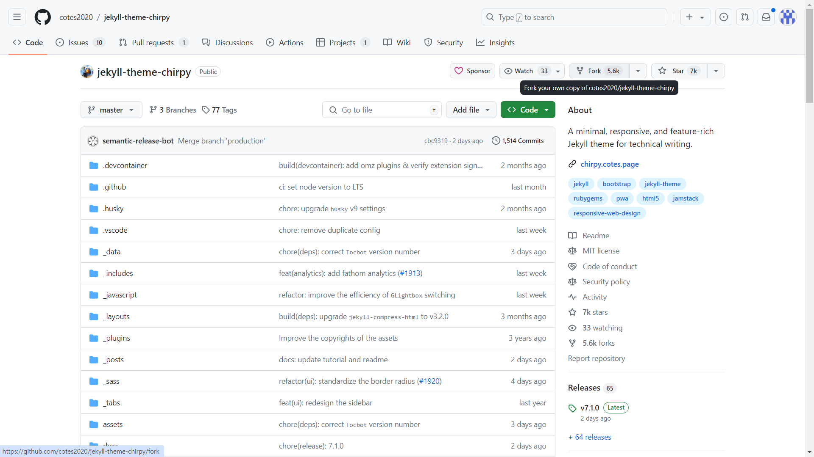
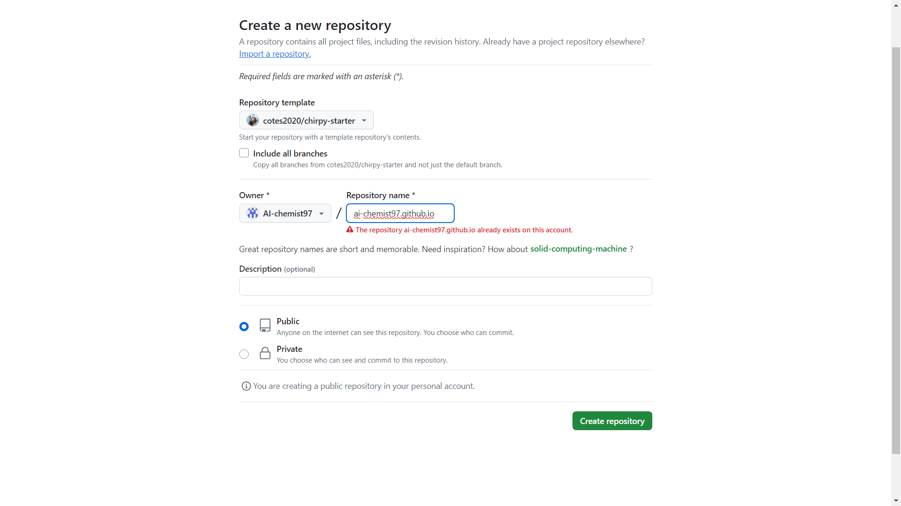

# 포트폴리오 만들기
최종으로 깃 블로그를 제작하게 되었지만, 깃 블로그를 만들기 전에 상당히 오랜 시간 고민했다. 포트폴리오를 만들 생각은 2024년도 초 부터 하였으니 고민만 반년을 한 셈이다.
사실 고민만 하고 있지는 않고 실질적으로 만들어보고 주변 사람들에게 의견을 물어보기도 했는데, 생각보다 결과물이 마음에 들지 않거나 다들 다른 것을 추천해주는 바람에 제대로 만드는건 지금에 와서가 되었다.

git blog는 이전에도 몇 번 추천을 받았는데 추천해주는 사람들 말투가 다들
"뭐...제일 좋은건 깃 블로그지...ㅎㅎ(니가 가능하다면...ㅋ)" 같은 느낌이라 시도를 못 해봤었다.

티스토리는 그냥 일기쓰는 느낌으로 포트폴리오적인 의미는 거의 없다고 해서 기각했고, 깃허브는 포트폴리오처럼 보여주기에는 뭔가 불편한 느낌이 있어서 고민하던 중 노션을 추천받았었다. 근데 노션을 좀 제대로 쓰려면 유료 옵션이 필요한 느낌이라 좀 더 기술적으로도 보여줄 수 있고 깃 허브를 통해 쓸 수 있는 git blog로 정하게 되었다.
사실 무료인데 기술적으로도 뭔가 보여줄 수 있다는 장점이 가장 크다.

# git blog 만들기
만드는 방법에서 마주한 오류를 적어보겠다.
근데 막상 적으려고 보니 대부분 루비의 버젼이 어긋나서 생긴 문제가 많았어서 다른 컴퓨터로 직접 어긋난 버전으로 실험을 해보며 써야겠다.

1. 시작에 앞서 원하는 chirpy theme를 선택해야 한다.
"http://jekyllthemes.org/"
처피 테마 사이트 주소
이걸 url을 입력하면되는데 링크를 걸려니 https 주소가 아니라고 빌드 실패라 일단 그냥 올린다.

나는 여기 보이는 chirpy 테마를 선택하였는데, 선택 사유는 내가 디자인적 감각이 부족하다고 생각하지는 않지만! 디자인에서 문제가 있을 경우 어느 부분을 고쳐야 좋을지 잘 모르겠어서 다른 사람들이 많이 사용하는 테마를 선택하였다.
(그것이 비극의 시작이었다)

원래는 노란색을 좋아해서 노란색이 들어간 테마를 선택했었는데, 아무도 선택하지 않았고 포트폴리오로 사용했을 때 읽기 좀 어려운 느낌이 들어서 겸사겸사 변경을 하기로 했다.

사실 이때도 한 번 사이트를 깃블로그를 만들었었는데 너무 쉽게 만들어져서 "아~ 나 좀 재능있넹ㅋ 코딩 천재 나가신다."하고 그냥 무지성으로 repository 밀어버렸다.

2. theme를 선택한 뒤에는 크게 2가지 방법으로 나뉘는데 
    1. 해당 사이트에서 직접 zip파일을 다운받아 진행하는 방식
    2. homepage로 들어가 테마를 fork하고 그 포크한 repository 이름을 
        * {}:이 괄호 부분은 실제로는 쓰지 않는다
    {username}.github.io
    이렇게 지은상태로 fork 하는 방법이다.

나는 이 2가지 방법을 다 사용해 봤었는데 결국 성공한 방법은 2번이었기 때문에 (지금 1번을 하면 성공할 자신이 있는데, 취업하고 시간나면 테마를 바꿀 것이다. 다른거 마음에 든다.)
    
    마우스 커서가 있는 부분을 클릭하면 된다.
    
    이미 만들어 두었기 때문에 나는 내 username.github.io로 repository를 만들 수 없다고 뜬다.
    다음과 같이 만들고 public 으로 설정해 준다.

이제 기본 설정이 끝났다. 여기까지는 간단한 튜토리얼 이었고, 이제 본편에 들어가야 한다.