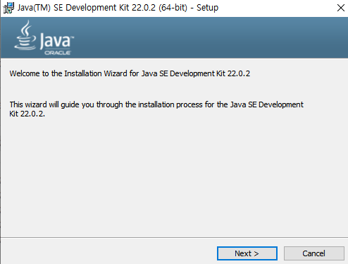

python은 그런게 없었는데 JAVA는 환경변수랑 뭐 부터 해서 따로 설정할 게 많은 것 같다. 툴도 이클립스 인텔리제이 이렇게 두 개 IDE가 있다는데 인텔리제이가 좋다는 평이 압도적이다. 일단 인텔리제이를 해보고 문제가 생기면 이클립스로 갈아탈까 아니면 반대로 이클립스를 하다가 갈아탈까 고민중인다.

찾아보니 SWEA에서 IDE를 이클립스만 허용해주는 것 같으니 우선 이클립스 기준으로 개발환경을 구축해보겠다.

# Java 개발환경 구축하기

## Java 설치하기

재설치중

[Java 설치 링크](https://www.oracle.com/java/technologies/downloads/)
많은 블로그에서 JDK가 아닌 SE 버젼을 다운링크로 걸어놨던데
[Java SE 설치 링크](https://www.oracle.com/kr/java/technologies/javase/javase8-archive-downloads.html)

막상 위에도 다운받아보니 SE Development Kit 이라고 뜬다.

<!-- 사실 아직 초기 단계라 차이를 잘 모르겠지만 JDK는 개발자 툴이고 Java SE를 포함한다는 정보를 여럿 보았기 때문에 우선 JDK로 다운로드한다.  -->

문제 시 수정

자바 설치 링크를 통해 자바를 다운 받는다. 이전에 컨설턴트님이 21버젼 이후에서 사용하는 Virtual Threads(Project Loom) 기능이 몹시 좋으니 사용하는 걸 추천하셨기 때문에 제일 최근에 나온 22버전을 다운 받겠다.

단순하게 x64 installer를 다운

다른 버젼이 설치되어있는걸 재설치해서 인지 그냥 close가 뜨고 끝났는데 다음에 노트북을 사면 다시 도전해보겠다.

### 환경변수 설정

win키를 누르고 환경이라고 치면

요런 목록이 뜬다 클릭 후

고급 창으로 들어가 환경 변수를 클릭한다.

시스템 변수에서 새로만들기를 통해 JAVA_HOME 이라는 변수를 추가한다. 변수값은 본인 자바가 설치된 경로

그다음에는 path에 경로를 추가해야한다.
%JAVA_HOME%\bin
추가하기

사용자 변수도 변경해 줘야 하는데 path를 편집하여
하위 bin 경로 까지 추가하여 편집하고,
확인을 누르면 설정이 끝난다.

## eclipse 설치하기

[Eclipse 설치링크](https://www.eclipse.org/downloads/)
추후작성
이클립스와 자바는 지원버젼이 있어 맞춰야 하는데 해당 버전이 오류가 난다는 반응이 있어 추후 작성예정

https://nazzang19.tistory.com/127

https://www.oracle.com/java/technologies/downloads/

JAVA설치

검색창에 시스템 환경변수 편집

