python은 그런게 없었는데 JAVA는 환경변수랑 뭐 부터 해서 따로 설정할 게 많은 것 같다. 툴도 이클립스 인텔리제이 이렇게 두 개 IDE가 있다는데 인텔리제이가 좋다는 평이 압도적이다. 일단 인텔리제이를 해보고 문제가 생기면 이클립스로 갈아탈까 아니면 반대로 이클립스를 하다가 갈아탈까 고민중인다.

찾아보니 SWEA에서 IDE를 이클립스만 허용해주는 것 같으니 우선 이클립스 기준으로 개발환경을 구축해보겠다.

# Java 개발환경 구축하기

## Java 22 설치하기

자바 설치 링크를 통해 자바를 다운 받는다. 이전에 컨설턴트님이 21버젼 이후에서 사용하는 Virtual Threads(Project Loom) 기능이 몹시 좋으니 사용하는 걸 추천하셨기 때문에 제일 최근에 나온 22버전을 다운 받겠다.

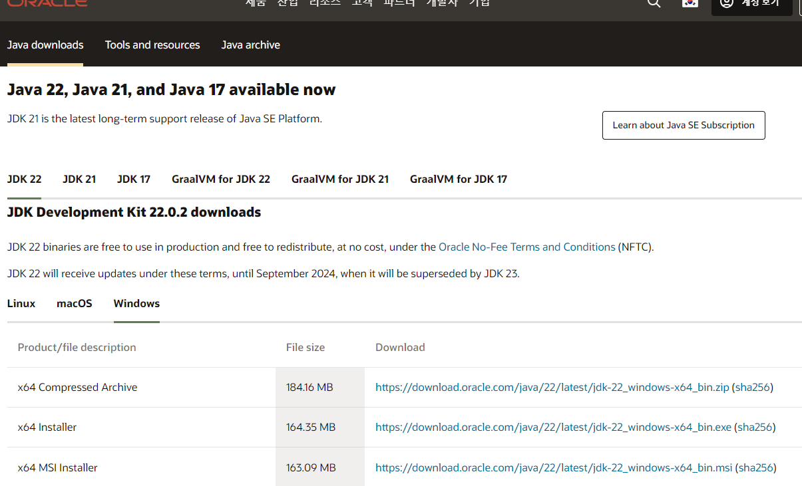
단순하게 x64 installer를 다운
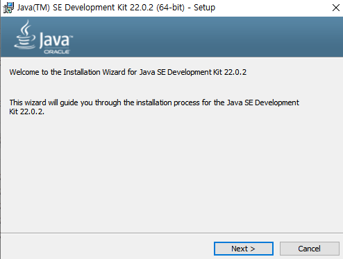
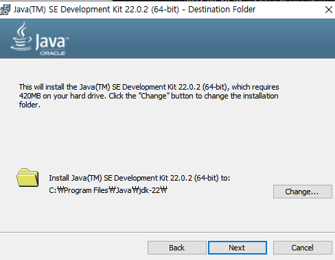
다른 버젼이 설치되어있는걸 재설치해서 인지 그냥 close가 뜨고 끝났는데 다음에 노트북을 사면 다시 도전해보겠다.

### 환경변수 설정

win키를 누르고 환경이라고 치면

요런 목록이 뜬다 클릭 후
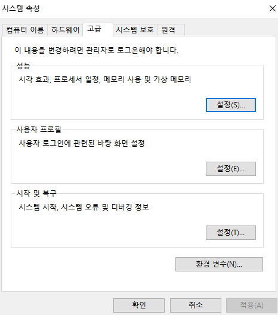

고급 창으로 들어가 환경 변수를 클릭한다.
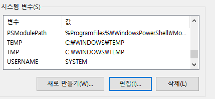
시스템 변수에서 새로만들기를 통해 JAVA_HOME 이라는 변수를 추가한다. 변수값은 본인 자바가 설치된 경로
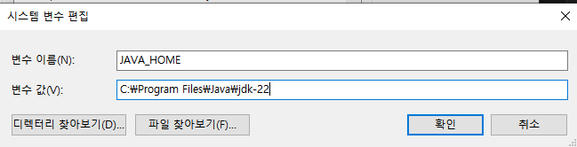

그다음에는 path에 경로를 추가해야한다.
%JAVA_HOME%\bin
추가하기

사용자 변수도 변경해 줘야 하는데 path를 편집하여
하위 bin 경로 까지 추가하여 편집하고,
확인을 누르면 설정이 끝난다.

### eclipse 설치하기

[Eclipse 설치링크](https://www.eclipse.org/downloads/)
추후작성
이클립스와 자바는 지원버젼이 있어 맞춰야 하는데 해당 버전이 오류가 난다는 반응이 있어 추후 작성예정
---
## Java 17 설치하기
진행 중인 프로젝트에서 다른 팀원들과 버젼을 맞추는게 에러나 충돌을 줄일 것 같아 새로 설치하였다.

[[JAVA] WINDOW에 JAVA 설치 JDK 17 시스템 환경 변수 설정](https://nazzang19.tistory.com/127)

해당 블로그를 참고하여 진행했다.

1. 먼저 자바를 다운 받는다.
[Java oracle](https://www.oracle.com/java/technologies/downloads/)

해당 사이트로 들어가면 여러 자바의 버젼이 보이는데 이 중에서 JDK17을 클릭하면 아래와 같은 화면이 나온다.
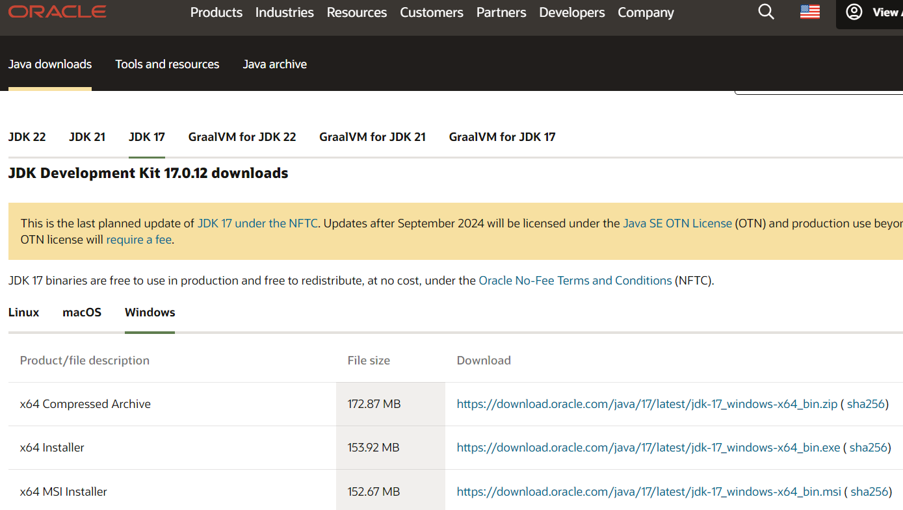
여기서 windows를 선택하고 x64 installer를 클릭하여 설치한다.

2. 다운받은 파일을 클릭하여 설치를 시작한다.
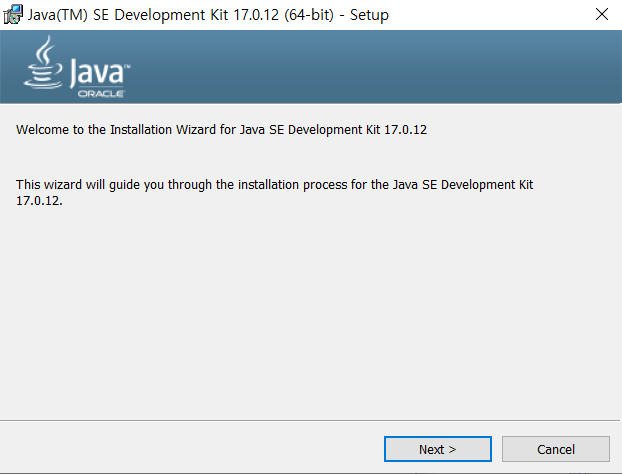
첫 화면은 이렇게 나오는데 파일 위치같은 것은 편한곳에 둬도 괜찮지만 그냥 지정해 준 대로 진행하는게 안전하기 때문에 따로 건들지는 않는다.
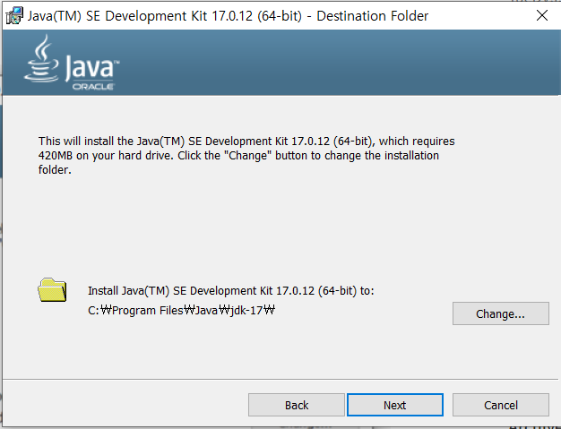

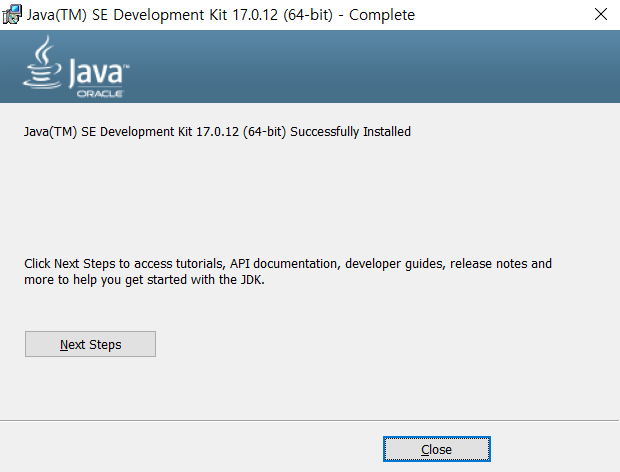

3. 검색창에 시스템 환경변수 편집을 검색하여 나온 창에서 환경 변수를 클릭한다.
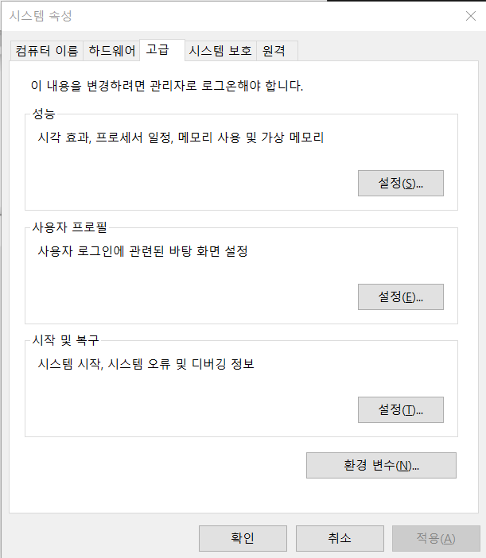
4. 해당 창에 시스템 변수에 JAVA_HOME 이라는 변수를 추가하고 설치한 jdk파일 위치를 설정해준다.
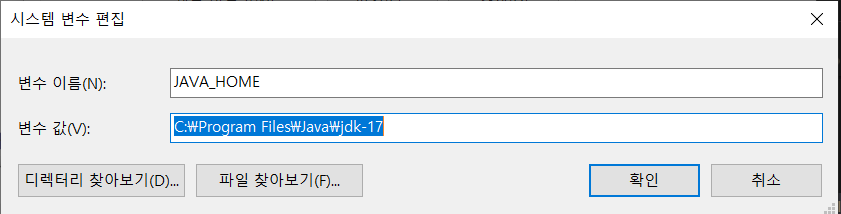
5. 추가로 CLASSPATH를 %JAVA_HOME%\lib 로 변경해준다.
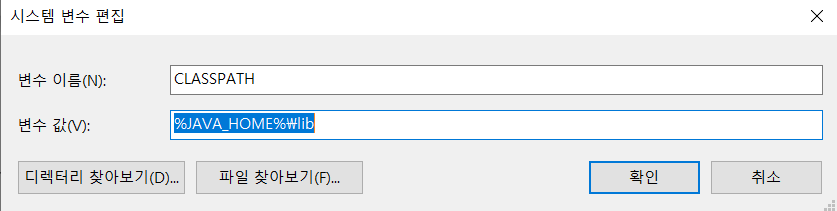
6. 시스템 변수 PATH를 편집을 통해 %JAVA_HOME%\bin 를 추가한다.
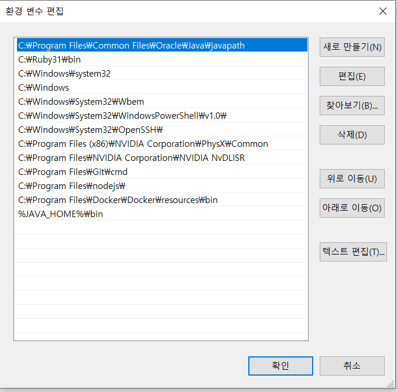
7. 추가된 것을 확인

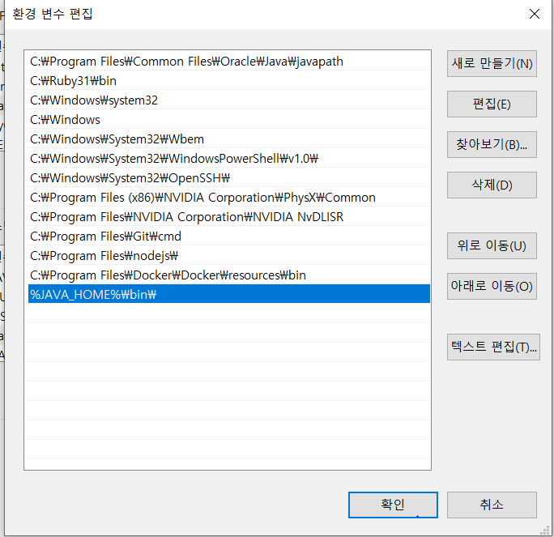
8. 마지막으로 자바 버젼을 cmd 창에서 java -version 으로 확인해보면 17이 성공적으로 설치된 것을 확인할 수 있다.
