개발을 하기 위해서 여러 방향으로 사용되는 git을 다운로드 하는 작업은 가장 기본적이다.
**Git**은 소스 코드의 변경 이력을 관리하고, 언제든 과거의 코드 상태로 돌아가거나, 이전 버전과 비교할 수 있어 버그를 추적하고 수정하는데 유용하다.

뿐만아니라, 각 개발자가 자신의 작업을 별도의 브랜치에서 진행한 후, 필요에 따라 메인 브렌치에 merge할 수 있다.

그리고 각 작업자가 로컬 저장소에 전체 프로젝트의 복사본을 가지고 있기 때문에 네트워크 연결이 불안정 하거나 오프라인에서도 작업할 수 있다.

github, gitlab, bitbucket과 통합되어 개발자가 협업과 코드 관리를 효율적으로 할 수 있다.

# git 설치
## 적합한 git 파일 다운로드
[git 다운로드 사이트](https://git-scm.com/)
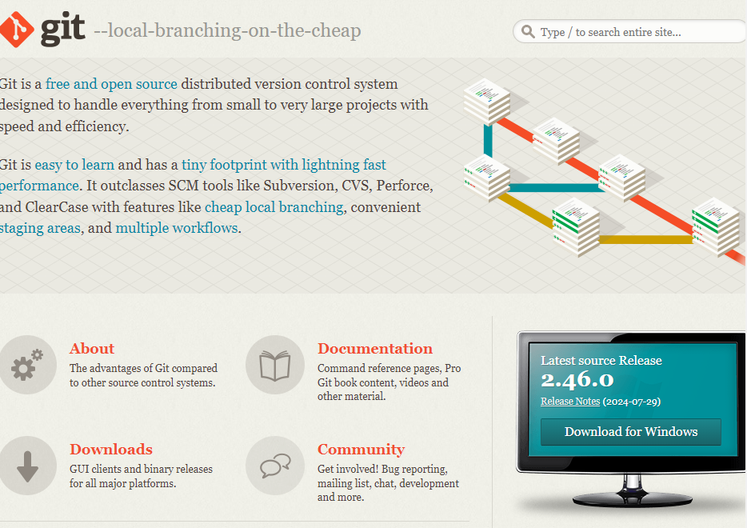
화면상에 모니터 속 "Download for Windows"를 클릭하면 
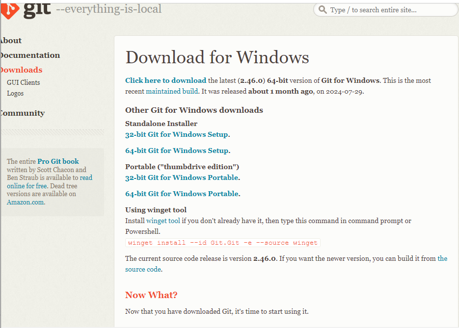
Standalone Installer에서 다운을 받아야하는데 자신이 사용하는 Window 운영체제가 32 비트인지 64 비트인지 확인을 해야한다.

CPU 구조(32비트/64비트) 확인은 win키+검색창에 '시스템'을 검색 후
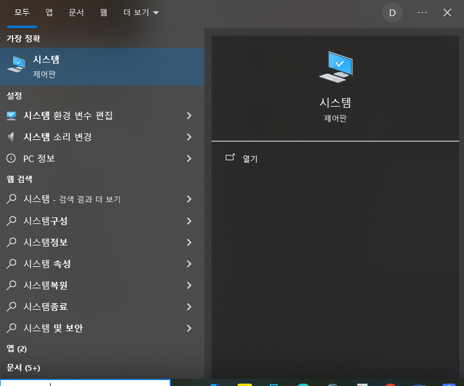
시스템 제어판 을 클릭한다.
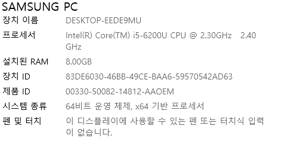
그럼 여기 새로 뜨는 정보창에서 시스템 종류를 확인할 수 있다.
내 노트북은 64비트!

## git 설치 진행하기

본인 컴퓨터에 맞는 파일을 다운로드 하고 설치를 진행합니다.
대 부분은 next를 눌러주면 되는데 절대 **git 설치 경로를 변경하면 안된다.**

세팅은 
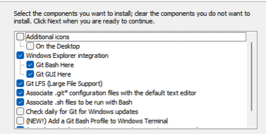
아래와 같이 맞춰준다.
쭉 진행하다가 
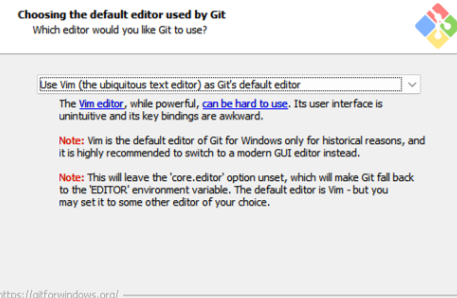
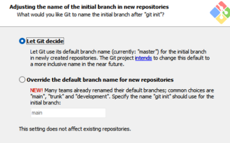
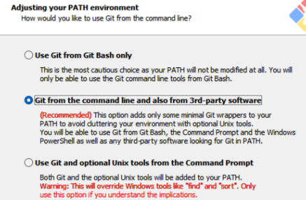

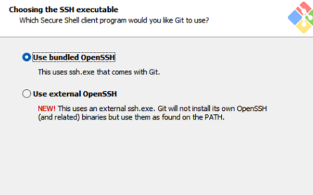
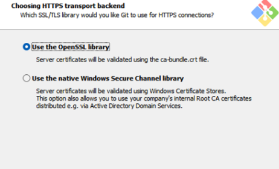
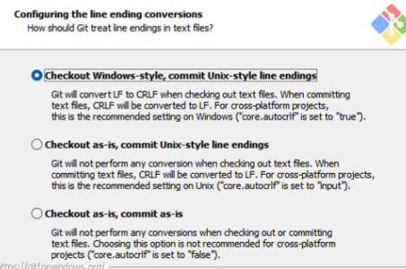
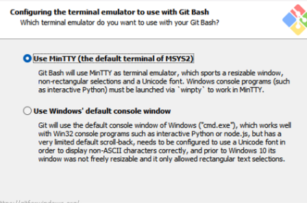
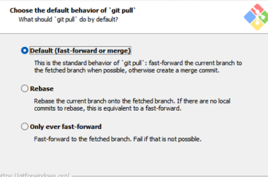
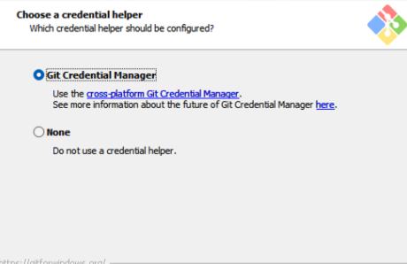
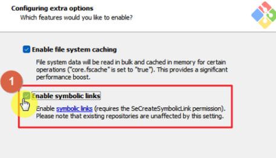
여기서 Enable symbolic links를 체크해 주는 이유는 
symbolic links를 활성화 함으로써 링크를 통해 원본 파일을 직접 사용하는 것과 같은 효과를 얻을 수 있기 때문이다.
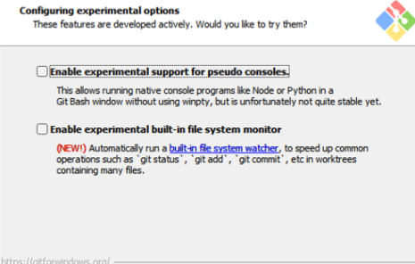
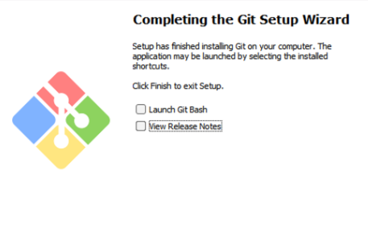
아래와 같이 설치 과정을 모두 거치면

설치가 끝난다.

잘 설치 되었는지 확인하기 위해 바탕화면에서 마우스 우클릭을 통해 git bash here (뜨지 않으면 더 많은 옵션 표시 클릭)가 뜨는지 확인하면 된다.