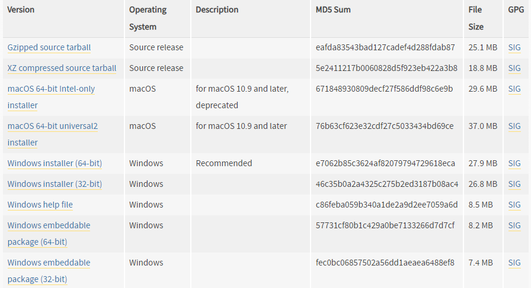
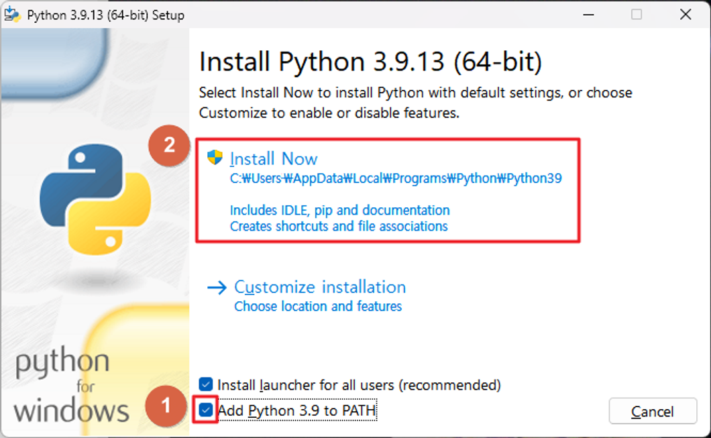
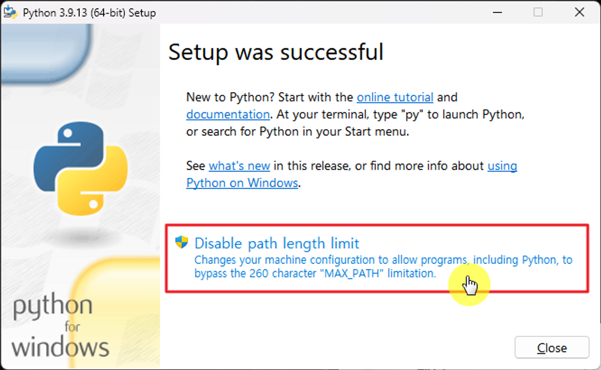
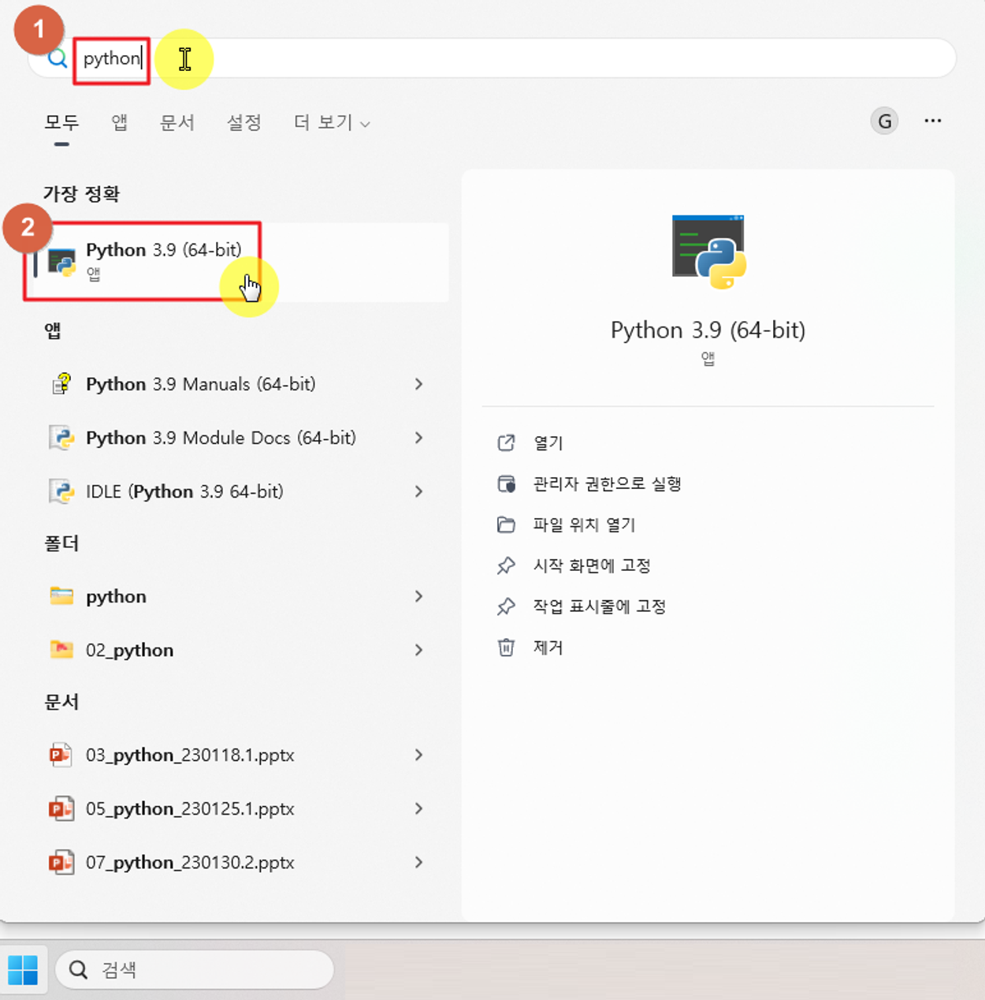
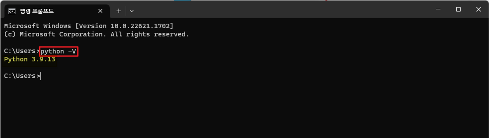

많은 개발 언어가 있지만 이 중에서 가장 쉽게 배울 수 있는 python, 그리고 한국에서 개발을 한다면 피할 수 없는 java 마지막으로 가장 컴퓨터스럽다는 c 언어 오늘은 이 중에서 가장 쉽게 배울 수 있다는 python 을 설치해 볼 것이다.

[python 다운로드](https://www.python.org/downloads/release/python-3913/)
해당 사이트에 접속하여 가장 아래 쪽으로 이동한다.

여기서 본인 cpu 구조에 해당하는 installer를 클릭하여 다운받는다.
<!-- [CPU 구조 확인](./2024-09-01-01_git-설치.md) -->

해당 버전은 3.9.13버전이다.

add python 3.9 to path에 체크하고 install now를 클릭한다.
app python 3.9 to path를 체크한 이유는 명령 프롬프트에서 파이썬을 실행할 수 있게 해주기 때문

설치가 완료되면 disable path length limit을 클릭하고 설치를 종료
disable path length limit을 클릭하는 이유는 windows는 파일 경로의 길이가 260자로 제한되어 있는데, 이를 초과하더라도 문제가 발생하지 않도록 길이제한을 해제한 것

## Python 설치 확인하기
1. 
win키+python 검색
2. 명령 프롬프트로 확인
    * win키+cmd 검색
    명령프롬프트 클릭
    * python -V를 입력후 엔터하면 설치된 python 버전이 출력됨
    V는 대문자, python --version 명령어도 버전 확인이 가능
    