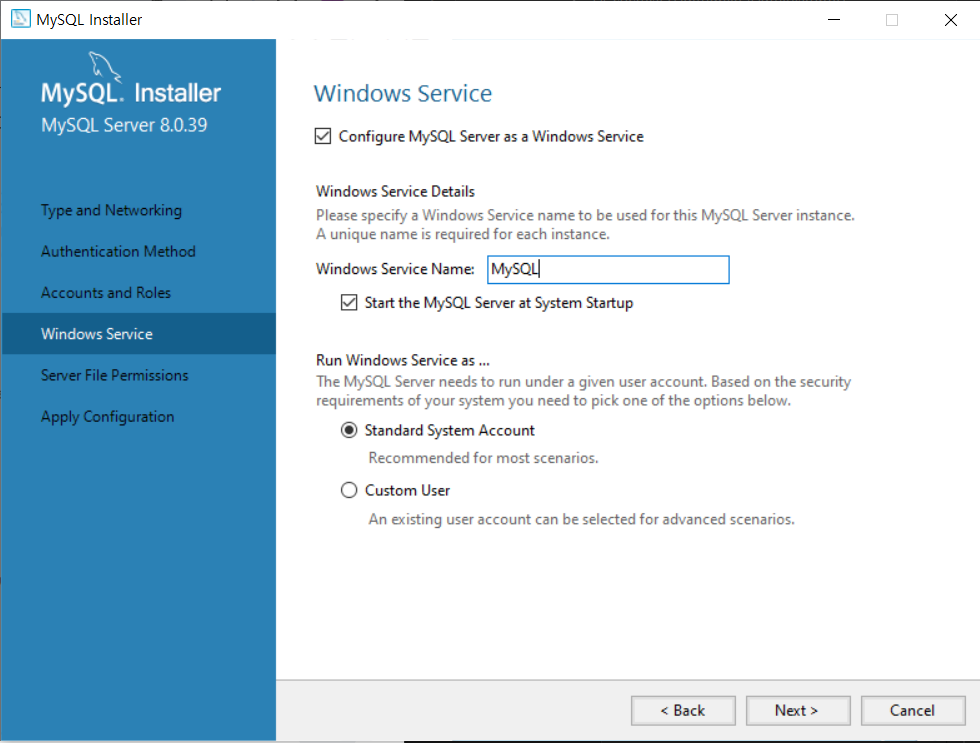

많은 개발 언어가 있지만 이 중에서 가장 쉽게 배울 수 있는 python, 그리고 한국에서 개발을 한다면 피할 수 없는 java 마지막으로 가장 컴퓨터스럽다는 c 언어 오늘은 이 중에서 가장 쉽게 배울 수 있다는 python 을 설치해 볼 것이다.

[python 다운로드](https://www.python.org/downloads/release/python-3913/)
해당 사이트에 접속하여 가장 아래 쪽으로 이동한다.

여기서 본인 cpu 구조에 해당하는 installer를 클릭하여 다운받는다.
[CPU 구조 확인](./2024-09-01-01_git%20설치.md)

해당 버전은 3.9.13버전이다.
추후 작성