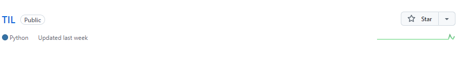
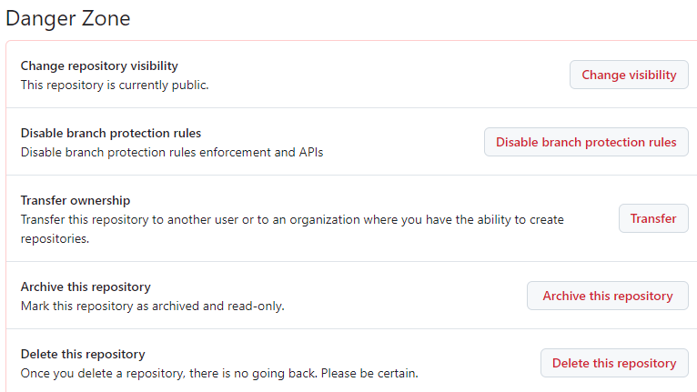
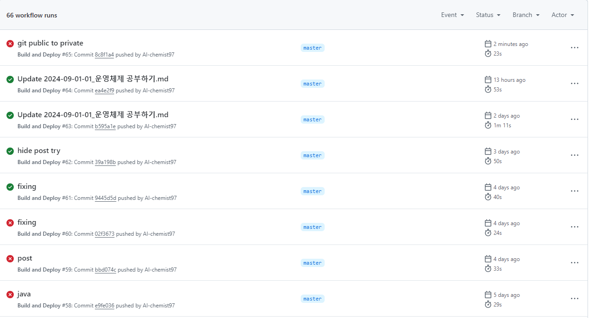

오늘 갑자기 싸피에서 좋은 말로 할 때 자료 관리 잘 하라는 단체 메시지를 받고 찔려서 repository를 private로 돌리는 김에 방법을 적어보려고 한다.

일단 이 레포를 private로 돌릴 생각인데 해당 레포를 클릭해서 들어가면

상단에 이런 바를 발견할 수 있다.
여기서 맨 끝 Settings를 클릭

나오는 화면에서 바로 아래로 쭉 스크롤을 내리면

요런 부분이 나오는데 여기서 첫 번째 버튼을 눌러주면 상태를 private로 바꿀 수 있다.

public으로 전환도 같음!

---
+추가
나는 git blog가 정말 무섭다. 그래서 돈만 있다면 노션을 추천하고 싶다.
이미지를 좀 대충 넣었다 하면
"안녕? 나 왔어"
하고 빌드가 실패한다. 실패한 빌드 재 빌딩하러 간다.
이 글이 올라오면 빌딩에 성공한 것이다.

