https://giveme-happyending.tistory.com/203

https://velog.io/@ckstn0777/2%EC%9E%A5-MySQL-%EC%84%A4%EC%B9%98

https://dev.mysql.com/downloads/windows/installer/8.0.html

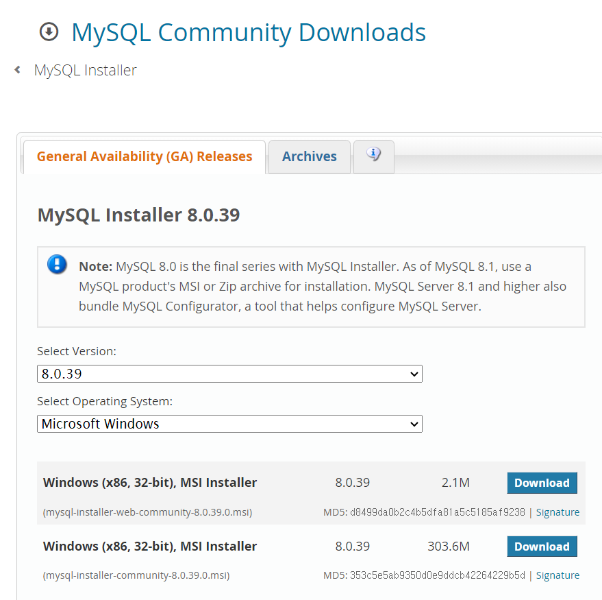

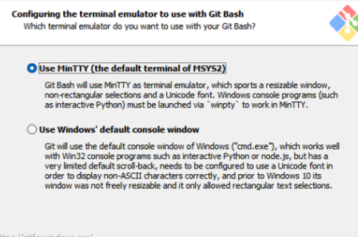

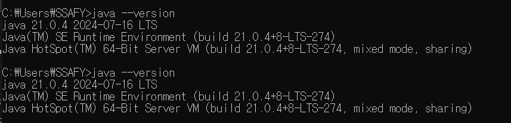

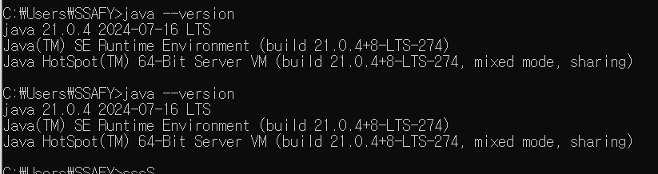

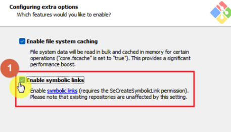
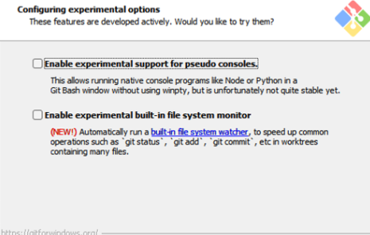

1234

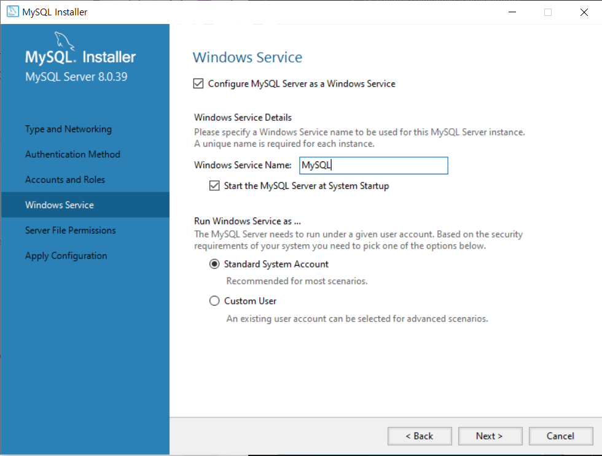

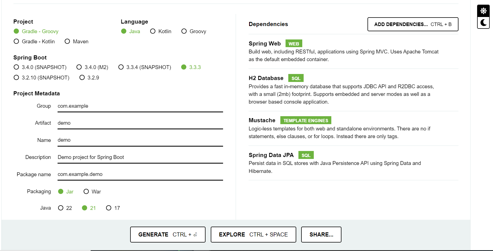

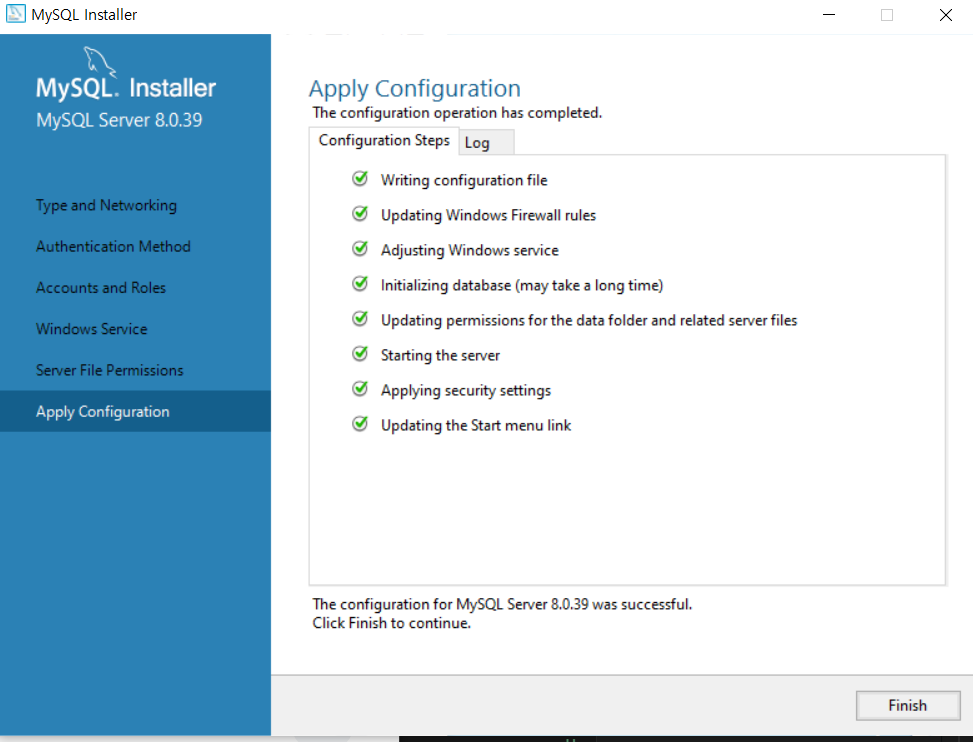

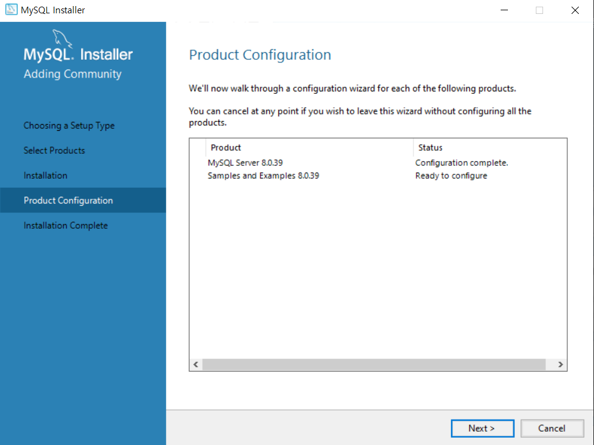

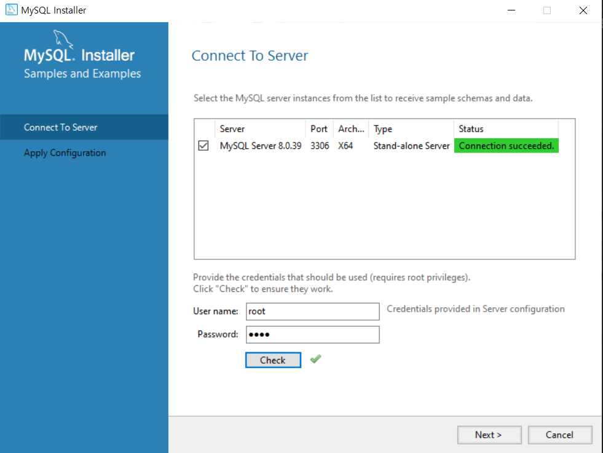

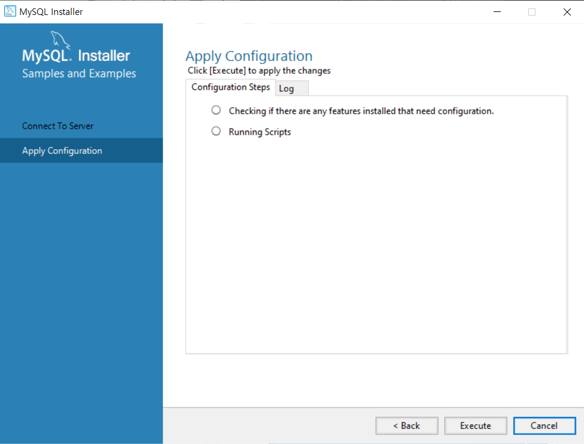

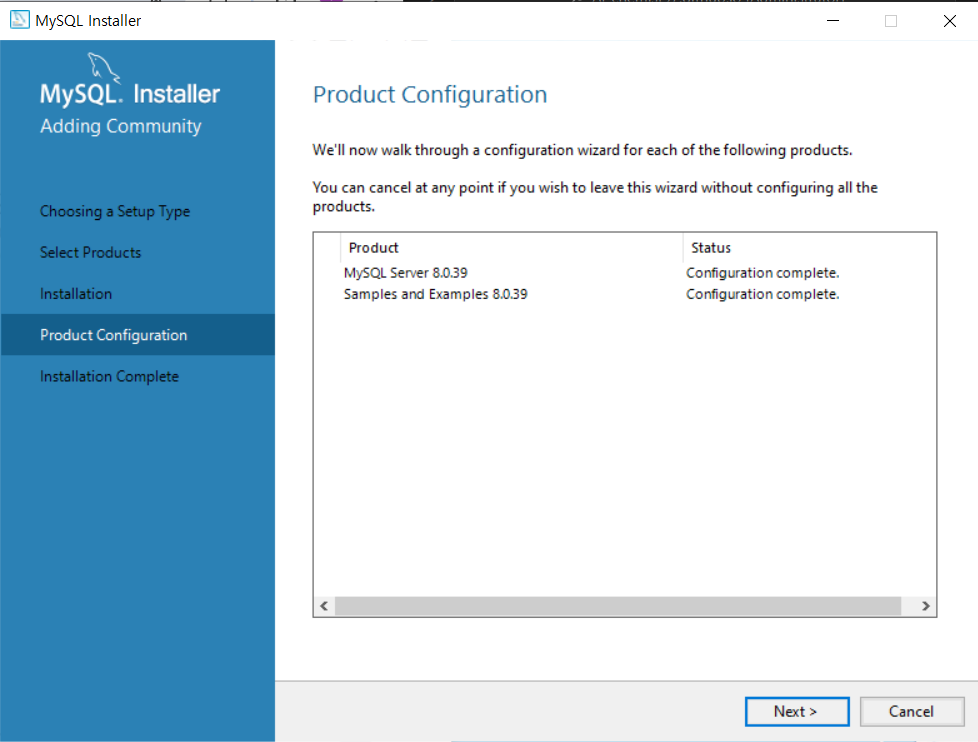

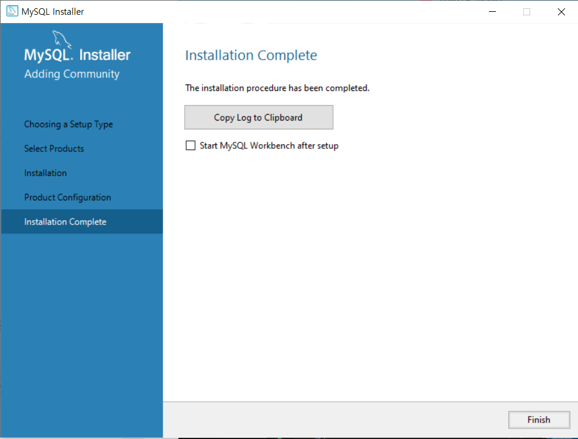