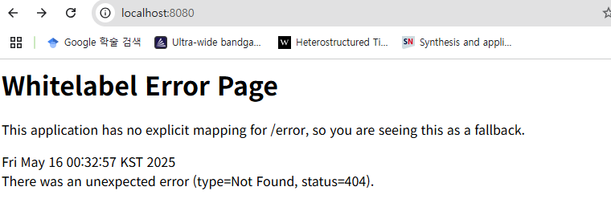

# Docker 컨테이너 만들기
Docker 컨테이너는 개발 환경을 하나의 이미지로 잘 포장해서,
어디서 실행하든지 동일한 환경에서 어플리케이션이 돌아가도록 도와주는 도구다.

특히 협업할 때 각자 다른 환경에서 발생할 수 있는 에러나 문제를 줄여주기 때문에
"내 환경에서는 잘 되는데?" 같은 상황을 막는 데 아주 유용하다.

## Dockerfile 작성
확장자 없이 Dockerfile이라는 파일을 생성하고
```Dockerfile
FROM openjdk:17-jdk-alpine
VOLUME /tmp
ARG JAR_FILE=build/libs/*.jar
COPY ${JAR_FILE} app.jar
ENTRYPOINT ["java", "-jar", "/app.jar"]
ENV SPRING_PROFILES_ACTIVE=docker
```
이 내용을 붙여 넣어준다.
이 내용이 의미하는 것은
* 자바 17을 베이스 이미지로 사용한다.
* 빌드된 .jar 파일을 컨테이너 내부로 복사해서 실행한다.
* `application-docker.properties`를 사용하도록 환경 변수도 지정해준다.

```
로컬이랑 도커, 왜 포트를 따로 설정했을까
Spring Boot를 개발하다 보면 로컬에서 실행하는 경우도 있고, Docker 컨테이너 안에서 실행할 때도 있다.
근데 이 두 가지를 동시에 돌리면 문제가 생긴다. 대표적인 게 포트 충돌이다.

예를 들어, 로컬에서 8080 포트를 쓰고 있는데 Docker 컨테이너에서도 8080을 쓰려고 하면 실행이 안 된다.
이미 포트를 누가 쓰고 있기 때문이다.

그래서 해결 방법으로 포트를 아예 나눠서 쓰기로 했다.

로컬 실행 → 8080 포트

도커 컨테이너 실행 → 8081 포트

MySQL도 마찬가지다. 로컬에서 3306을 쓰고 있다면, 컨테이너에서는 3307로 설정해서 포트 충돌을 피했다.

이렇게 포트를 분리해두면 좋은 점이 많다.

로컬이랑 Docker를 동시에 실행할 수 있고,

각각 환경에 맞춰 테스트가 가능하고,

팀원마다 로컬 설정이 달라도 문제없이 공유할 수 있다.

즉, 포트만 잘 나눠도 개발할 때 겪는 귀찮은 문제들을 미리 막을 수 있다.
```

## docker-compose.yml 구성
```yaml
version: '3.8'

services:
  db:
    image: mysql:8.0
    container_name: gwabang-mysql
    restart: always
    environment:
      MYSQL_ROOT_PASSWORD: 1234
      MYSQL_DATABASE: gwabang
      MYSQL_USER: root
      MYSQL_PASSWORD: 1234
    ports:
      - "3307:3306"  # 로컬포트:컨테이너포트
    volumes:
      - db-data:/var/lib/mysql
    networks:
      - gwabang-net

  app:
    build: .
    container_name: gwabang-app
    depends_on:
      - db
    ports:
      - "8082:8081"  # 로컬포트:컨테이너포트
    networks:
      - gwabang-net

volumes:
  db-data:

networks:
  gwabang-net:
```
- MySQL은 컨테이너 내부에선 기본 포트인 3306으로 실행되지만,
로컬에서는 3307로 접근할 수 있도록 포트를 매핑했다.

- Spring Boot 애플리케이션도 마찬가지로,
컨테이너 내부는 8081, 로컬에선 8082로 접근하도록 설정했다.

-> 이미 로컬에서 3306이나 8080 포트를 쓰고 있는 상황이라면 이렇게 포트를 다르게 매핑해주는 게 충돌을 방지할 수 있다.

## application-docker.properties
```properties
spring.application.name=gwabang

spring.datasource.url=jdbc:mysql://gwabang-mysql:3306/gwabang
spring.datasource.username=root
spring.datasource.password=1234
spring.datasource.driver-class-name=com.mysql.cj.jdbc.Driver

spring.jpa.hibernate.ddl-auto=update
spring.jpa.show-sql=true
spring.jpa.properties.hibernate.dialect=org.hibernate.dialect.MySQL8Dialect

server.port=8081

```
- gwabang-mysql은 docker-compose에 정의한 DB 서비스 이름으로,
컨테이너 간 통신을 위해 host로 사용된다.

- server.port=8081은 앱이 컨테이너 내부에서 8081 포트로 실행되도록 설정한 부분이다.

---
# Docker 실행
## Docker 실행 순서
1. 
```bash
gradlew clean build
# jar만들기
docker build -t gwabang .
# 도커이미지 빌드 이미지 이름을 과방이라고 tag, 과방이라는 이름의 도커 이미지 생성 . 현재 디렉토리에서 Dockerfile 찾아서
# docker run -p 8081:8081 gwabang
# 이런식으로 하는 경우도 있음 컨테이너 실행
docker-compose up --build
# 도커 컴포즈 실행
```
* --build 옵션을 주면 Dockerfile을 기준으로 새롭게 빌드해서 실행된다.

* 이후 로컬에서 아래 포트로 접근하면 된다:
    * 애플리케이션: http://localhost:8080
    * MySQL: `localhost:3306`

## 로컬과 도커를 함께 사용할 경우
이걸 위해서 두개로 만들었따
`application-docker.properties`
`application.properties`
인텔리제이 같은 IDE에서 로컬로 실행할 경우엔 포트만 다르게 설정해주면 된다.
```properties
# application.properties (로컬용)
spring.datasource.url=jdbc:mysql://localhost:3306/gwabang
server.port=8080
```
요렇게 하면 포트 충돌 없이 두환경 동시에 위잉위잉 테스트 가능!

아직 페이지를 안만들어서 그렇지만 이렇게 성공적으로 짜란

 
[github - gwabang](https://github.com/AI-chemist97/gwabang)

private이라 안보일수도있음