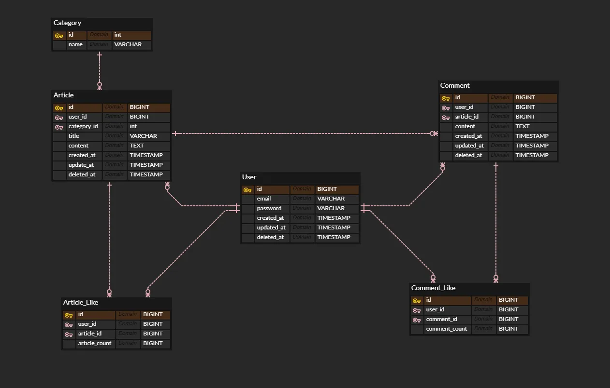

# Spring 개발 폴더 구조
개발을 진행하면서 entity를 내가 짜서 넣겠다고 했다.
근데 과거에 개발을 급하게 진행하면서 해서 기억이 잘 나지않아 하나씩 다시 짜면서 정리해 두려고 한다.

우선 erd 테이블 종류별로 폴더를 생성한다



일단 여기 있는 총 5종류의 이름의 폴더를 생성한다
원래 보다싶이 User 테이블인데 생각해보니 저번 개발에서도 User가 이미 자바 표준 라이브러리에 User 클래스가 있어서 잘못쓰면 충돌이 날 수 있다고 들었던 것 같아 팀원에게 제안하여 Member로 바꾸기로 했다.
해당 코딩은 바꾸는 와중에 하고 있어서 이미지는 우선 User지만 Member 테이블로 생각하고 제작한다.
member, article, comment, articlelike,commentlike, category....
이렇게 대충 폴더를 만들어 주고 member 부터 시작한다
보이는 그대로 일단 만들어주고 join같은 관계성은 다 만들고 다음 글에 수정하겠다.

onetomany manytoone...
화이팅
파일 구조는 최종 깃에서 확인 가능하다.
우선 member 의 경우 entity 폴더 내부에 Member.java
를 생성해야한다.

📂 entity<br>
 └── 📄 Member.java

```java

@Getter
@Builder
@AllArgsConstructor
@NoArgsConstructor(access = AccessLevel.PROTECTED)
@Entity
@Table(name = "member")
public class Member {

};
```
### 위에 달린건 뭐지?
위에 달린건 어노테이션 annotation이라고 하는데 **코드에 정보를 추가해서 자동으로 기능을 붙이는 것**이다.

- @Getter
모든 필드에 대해 getter 메서드를 자동으로 만들어준다.

getName(), getEmail() 이런 거 일일이 안 만들어도 됨.

- @Builder
객체를 new Member()로 만드는 게 아니라,
```java
Member.builder()
       .name("홍길동")
       .email("test@example.com")
       .build();
```
이런 식으로 만들 수 있게 해주는 패턴.
어려워 보일 수 있는데, 나중에 보면 이게 더 깔끔함. 익숙해지면 편할수도!

- @AllArgsConstructor
모든 필드를 파라미터로 받는 생성자를 만들어줍니다.

```java
new Member(1L, "홍길동", "test@example.com");
✅ @NoArgsConstructor(access = AccessLevel.PROTECTED)
```
기본 생성자 (아무 파라미터도 없는 생성자)를 만들되,
외부에서는 못 쓰고 JPA가 내부에서 사용할 수 있게 protected로 제한합니다.

- JPA에서는 기본 생성자 필수기 때문에 그냥 필요하다 생각하면 된다.
    - JPA는 뭔가?
      - **JPA (Java Persistence API)**는
자바에서 객체(Object)와 데이터베이스(Table)를 연결(매핑)해주는 표준 기술.
쉽게 말해서 우리(개발자)가 클래스 (ex. Member, Category, Comment 등)를 만드는데 실제 데이터는 DB의 테이블에 들어감 (member, category 등)
이때 
클랜스: 테이블
필드: 컬럼
이런식으로 자동으로 연결되고
SQL 없이도 CRUD(조회, 저장 삭제 등) 하게 해주는 게 바로 JPA!
```java
Member member = new Member(1L, "홍길동");
memberRepository.save(member);  // INSERT 쿼리 안 써도 자동으로 저장됨

```
이렇게!


- @Entity
이 클래스는 JPA가 관리할 테이블이라는 뜻.

즉, 이걸 DB에 저장하거나 불러올 수 있다는 의미.

- @Table(name = "member")
DB에서 실제로 사용할 테이블 이름을 지정.

테이블 이름이 member라는 뜻.


---
## 마무리
이렇게 해서 Member나 다른 엔티티 기본 틀을 만들었다.
JPA를 쓴다면 필수로 들어가는 기본 세팅이라고 기억해두기.

다음 글에서는 이 Member 엔티티와 다른 엔티티 간의 관계,
즉 @OneToMany, @ManyToOne 같은 관계 매핑을 넣어주면서 정리할 것.
실제로 어떻게 조인되는지 보면서 감을 잡겠다!

화이팅!!


[github - gwabang](https://github.com/AI-chemist97/gwabang)

private이라 안보일수도있음