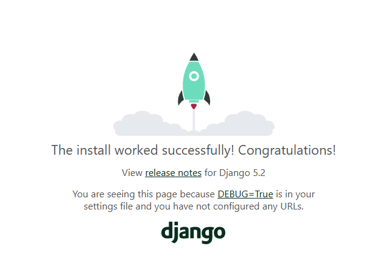

# 사용 기술
백엔드: python(django)
프론트엔드: 부트스트랩? Vue3 next.js를 써볼까

# Frontend & Backend

* **Frontend**: 사용자가 직접 보게 되는 화면 (HTML, CSS, JS, 프론트 프레임워크 등)
* **Backend**: 사용자 눈에는 안 보이지만 요청/응답/DB처리/보안 등 핵심 로직이 처리됨 (Python, Java, DB, API 등)
  ==>Django를 이용해 Backend(서버)를 만들 예정

---

# Framework

## 웹 프레임워크란?

> 웹 서비스 만들 땐 로그인, 회원관리, DB, 보안 등등... 너무 복잡하니까
> 이미 잘 만들어진 틀(프레임워크)을 활용하자!

* 프레임워크 = 거인의 어깨 위에서 프로그래밍하기
* 빠르게, 체계적으로, 효율적으로 개발 가능
---

## Django (장고)
우선 vscode를 준비하고 github에 ~~newmovie라는 이름의 repository를 팠다.~~
FlickTalk로 변경~


* **Python 기반** 대표적인 웹 프레임워크
* 로그인, DB연동, 보안 등 기본기능 탑재
* 이유 있는 선택

  * 다양성, 확장성, 보안, 커뮤니티 등 장점 많음

<!-- 아직은 새 영화라는 이름이지만 추후에 이름이 생기면 꼭 바꿔줘야지 -->

이 레포를 clone해서 개발을 진행하기에 앞서 gitignore를 만들어서 넣어줘야하는데

* gitignore 를 쉽게 작성하는 방법
    * [gitignore.io](https://www.toptal.com/developers/gitignore/) 에서 설정하면 꿀!
    * 설정 목록은 사용언어, 환경, 에디터, 프레임워크
        > 예시: Python, VisualStudioCode, Django, Jupyternotebook, pycharm, vue, node
        * 생성된 내용을 그대로 복사하여 .gitignore 에 붙여넣자!

이 방법을 사용해서 쉽게 만들 수 있다.

이렇게 만든 gitignore 파일을 슬쩍 넣어둔다.
여기서 vscode를 열고 backend폴더를 만들어서 개발을 시작해보자.

---

# 가상환경 (venv)

> 프로젝트마다 독립적인 개발환경이 필요함
> 패키지 간 버전 충돌 방지! 안정적 유지!

### venv 사용 이유

* 프로젝트 A, B가 서로 다른 패키지/버전 쓸 경우 충돌 방지
* 재설치 없이 독립적 개발 가능

### 가상환경 만들기


1. 여기에 일단 가상환경을 설정해주고...
`python -m venv venv`
나 가상환경 만들건데 venv가 이름임~ 이라는 의미

이걸 하면 python을 사용하는 어 환경 생성~

2. 실행
`source venv/Scripts/activate`

입력하면 터미널 주소가 써 있는 왼쪽 위쪽에 (venv)라고 써지게 된다 이걸로 온 오프를 확인할수 있음

`deactivate`
라고 치면 종료된다

→ 터미널에 `(venv)` 표시되면 켜진 상태

### 패키지 목록 확인 & 공유
3. `pip list`를 치면 어떤 패키지가 있는지 현재 환경에서 보여줌
   패키지들 간 의존하고 있는 경우가 있기 때문에 하나의 버젼이 바뀌면 모든 의존성이 깨질 수 있음
   => 그래서 서로 독립적인 개발환경이 필요하고 패키지 목록이 필요함

3. 장고 설치
   `pip install django`
   이걸 안 해주고 하면 안되거나 가상환경말고 그냥 로컬에 설치된 django가 실행된다...


4. 가상환경 패키지 목록 공유
   `pip freeze> requirements.txt`
   pip freeze 출력 결과를 저 파일에 써라
   `requirements.txt` 파일로 누구나 같은 환경을 만들 수 있음
   ```bash
   pip install -r requirements.txt
   ```
   이렇게 입력하면 같은 환경 만들기 가능

   가상 환경과 그 환경에 설치된 의존성 패키지 목록을 공유하는 것의 중요성
---

장고 실행 준비 끝!


~~~
! 장고 프로젝트 생성 전 루틴
1. 가상환경 생성
2. 가상환경 활성화
3. 장고 설치
4. 의존성 파일 생성(패키지 설치마다 진행)(requirements.txt. 같은 의존성 목록 파일을 업데이트 하라는 의미!, 패키지 설치후 바로 pip freeze 하라는 의미)
5. 프로젝트 생성
~~~


### 프로젝트 생성 명령어
1. firstpjt라는 이름의 프로젝트를 생성하려면?
`django-admin startproject firstpjt .`
저 .을 안붙이면 firstpjt라는 폴더가 만들어진다.
> `.` 붙이면 현재 폴더에 바로 생성됨 (안 붙이면 폴더가 한겹 더 생김)

이번에 진행할 프로젝트 이름은 newmovie니까 newmovie로 해서 진행
FlickTalk으로 하기로 했음
고민을 열심히 해봤는데 유저 간 영화를 바탕으로 한 의견 나누기, 수다
(그니까 2중 폴더가 된다는 말)

### 서버 실행
1. 실행을 위해 `python manage.py runserver` manage.py가 있는 경로에서 실행을 하면 된다.

` http://127.0.0.1:8000/`
이 주소에 실행이 되었는지 확인하면 된다.


# Django 구성 개념

## MTV = Django만의 MVC

* MVC: Model, View, Controller로 구분
* Django는 이름만 다름! (MTV: Model, Template, View)

| MVC        | MTV      |
| ---------- | -------- |
| Model      | Model    |
| View       | Template |
| Controller | View     |

=> 결국 역할은 비슷함 (이름만 파이썬식)

---
# Django는 크게 2가지로 구성됨

* **프로젝트**: 여러 앱을 포함하는 상위 단위 (세팅 관리)
* **앱**: 회원, 게시판 등 **기능별 단위**로 나눠짐
  → 유지보수, 기능 확장에 유리함

---

# 앱 생성과 등록

### 1. 앱 생성

```bash
python manage.py startapp articles
```

> 복수형으로 만드는 게 관례 (`articles`, `users`, `posts` 등)

### 2. 앱 등록

`settings.py` → `INSTALLED_APPS`에 추가

```python
INSTALLED_APPS = [
    ...
    'articles',
]
```

→ 만들기만 하고 등록 안 하면 Django는 이 앱을 모름!

---

## Django의 주요 파일 구조 이해하기

### `settings.py`

* **Django 프로젝트의 모든 설정값**이 들어있는 곳!
* 예: 설치된 앱 목록, DB 연결 정보, static/media 파일 경로, 언어 설정 등등…

### `urls.py`

* **웹 요청의 입구!**
* 우리가 브라우저에 주소를 입력했을 때,
  서버가 **"어떤 요청을 어디로 전달할지"** 결정하는 파일

```python
# 예를 들어 /articles/ 로 요청이 오면
# articles 앱의 views.py 로 연결되게끔 처리
```

* 실제 웹주소를 처리하는 첫 관문이라서,
  "서버 입구"라고 보면 됨

### `__init__.py`

* 이 파일이 폴더에 있으면, **"여긴 파이썬 패키지야\~"** 라고 알려주는 역할
* 그냥 빈 파일일 수도 있음 (진짜로 아무 내용 없이도 존재 의미 있음)
* 이게 없으면 파이썬은 해당 디렉토리를 패키지로 인식 못함

### 주소 끝에 `/`가 왜 붙을까?

* Django에서는 URL 끝에 `/` 붙는 게 **기본 관행** (ex: `/articles/`)
  → 이게 없으면 301 리다이렉트 발생함

```python
# 이거 헷갈릴 수 있는데 주소 끝에 `/` 붙이도록 습관화하기!
```

---

## 개발 팁

* `.gitignore` 파일은 보통 **`manage.py`와 같은 위치에 둠**
* venv로 가상환경을 만들면 자동으로 `.gitignore`에 포함되지만,
  다른 이름으로 만들면 직접 추가해야 함

```bash
# pip freeze로 의존성 목록 저장
pip freeze > requirements.txt

# 다른 사람은 이걸로 한방에 설치!
pip install -r requirements.txt
```

---
# 정리

* 웹은 클라이언트와 서버가 요청-응답하는 구조
* 프론트엔드는 사용자 눈에 보이는 화면
* 백엔드는 안 보이지만 핵심 로직 처리
* Django는 백엔드 개발용 웹 프레임워크
* 가상환경을 사용해 프로젝트별 독립성 유지
* 프로젝트와 앱으로 나눠 관리
* MVC(MTV) 디자인 패턴을 따른다


---


* git ignore를 만들어줘야 후에 깃에 프로젝트를 올릴 필요가없는 가상환경은 올라가지 않는다.
   * 용량이 너무 크고 git은 소스코드만 추적하는 곳인데, 이런 큰 바이너리 파일(사람이 읽을 수 없는 0과 1로 이루어진 파일)을 올리면 속도가 느려지고 용량도 낭비된다. requirements.txt 파일로 누구든지 그냥 만들수있음. `pip install -r requirements.txt`를 입력하여 requirements.txt 내 패키지와 버젼에 맞춰 설치한다.
==> 패키지를 삭제하려면 `pip uninstall 삭제하고싶은패키지이름`
어떤 버젼을 다운 받을 수있는지 보고싶다면?
`pip install Django==`
라고 치면 설치가등 버젼 보여줌
==> 근데 최신버젼은 안먹힘
`pip index versions Django`
최신버젼은 이렇게 입력을 해야함!
업글하려니 파이썬이 3.9. 라인 버젼이라 되지않음 5.2.3은 3.10부터 사용가능하다고!


venv 라는 이름으로 가상환경을 만들었다면 gitignore 에 자연스럽게 들어가 있지만 아니라면 따로 추가해주어야 한다.
* 그때 당시 개발에서는 장고 4.2를 썼는데 해당 버젼이 lts(장기적으로 지원하는 버젼) 이 있어서 긴 기간동안 보안 업데이트도 함.

당시 장고 5점대의 lts 버젼은 나오지 않아 4.2의 메인스트림을 이용하여 개발
2025년 06월 25일 저녁 9시 16분 확인해보니 5.2.3이 lts로 나와있음!

- 어떤 프로젝트를 진행하던지 설계에는 기준점이 필요하다. 개발자 마다 다른 기준점을 가지고 있는데 이럴때 나중에 어떤 문제가 발생할경우 기준점이 달라진다.


장고는 크게 프로젝트와 앱 2가지 구성요소로 나뉜다.
프로젝트는 앱을 포함하는 단위로 앱은 계속 늘어나지만 프로젝트는 아님
앱은 회원(회원관리, 회원탈퇴), 자유게시판 이런 건 둘이 성격이 다름
회원 앱 내부에서도 회원관리 회원탈퇴 기능별로 나눔 이게 프로젝트 사이즈가 커졌을때 관리가 쉽다.


프로젝트는 애플리케이션의 집합으로 세팅에 관련된 것들을 진행한다.
앱은 독립적으로 핵심적 기능을 담당


앱을 만드는 순서<br>
1. 앱 생성
`python manage.py startapp articles


[github - newmovie](https://github.com/AI-chemist97/newmovie)
