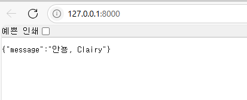
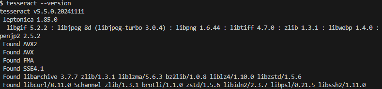
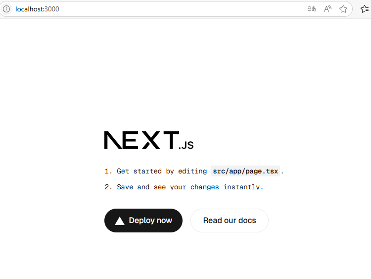
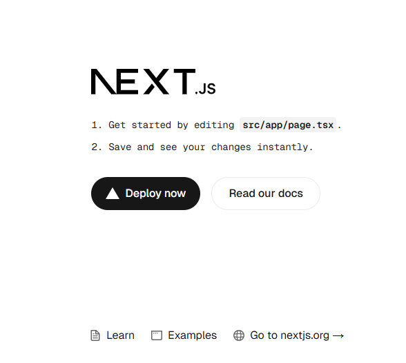

# Clairy – AI 문서 정리 웹앱 환경 세팅

문서 그냥 올리면 알아서 텍스트 뽑고, 어떤 문서인지 태그 달아주고, 나중엔 검색까지 할 수 있게 만든 웹앱이다.  
OCR + 분류기 + 검색 기능까지 포함된 사무 자동화 도구 느낌으로 만들고 있음.

(뭔가 크롬 패키지? 뭐라하지 툴같은거 처럼 작용해서 다운로드 받는 즉시 알아서 저장도 해주면 좋겠다 좋은 제목으로 논문 읽을때 정리가 제일 귀찮았음)

이번엔 그 개발 시작 단계, 환경 세팅 내용을 정리함.

---

## 🌐 기술 스택 정리(희망사항, 완료 또는 변동 시 수정 예정)

**Frontend**
- Next.js (TypeScript)
- Tailwind CSS
- Zustand (상태관리)

**Backend**
- FastAPI (Python)
- Tesseract OCR
- PostgreSQL (Supabase or Railway)
- JWT 기반 인증

**DevOps**
- Docker
- CI/CD: GitHub Actions
- 배포: Vercel (프론트), Render or Railway (백엔드)

---

## 🧾 프로젝트 구조

```bash
clairy/
├── frontend/       # Next.js 프론트엔드
├── backend/        # FastAPI 백엔드
├── docker/         # Docker 설정 (선택)
└── .github/        # CI/CD 워크플로우
````

---

## 📦 백엔드 (FastAPI) 환경 세팅

### 가상환경 만들기

```bash
python -m venv venv
source venv\Scripts\activate     # Windows
```

### 기본 패키지 설치

```bash
pip install fastapi uvicorn python-multipart pytesseract pillow

```
- fastapi: 웹 프레임워크

- uvicorn: FastAPI 서버 실행기

- python-multipart: 파일 업로드용

- pytesseract: OCR (이미지에서 텍스트 추출)

- pillow: 이미지 처리 라이브러리 (OCR할 때 필요)


### 의존성 저장

```bash
pip freeze > requirements.txt
```

### 서버 실행
main.py가 있어야 서버실행이 되기 때문에 해당 파일을 만들어 준다.
```python
from fastapi import FastAPI

app = FastAPI()

@app.get("/")
async def root():
    return {"message": "안뇽, Clairy"}
```
FastAPI의 비동기 함수가 제법 ㄱㅊ으니까 **기다리는 동안 딴 일도 가능한 함수**인 비동기 함수를 사용
* 동기: 1번이 끝나야 2번 가능
* 비동기: 1번기다리는동안 2번 가능

```bash
uvicorn main:app --reload
```



#### 이미지 업로드를 위한 api 생성

```python
from fastapi import FastAPI, UploadFile, File


app = FastAPI()

@app.get("/")
async def root():
    return {"message": "안뇽, Clairy"}


@app.post("/upload")
async def upload_file(file: UploadFile = File(...)):
    # 파일 이름 확인
    return {"filename": file.filename}
```
- UploadFile: 업로드된 파일을 비동기로 다룰 수 있는 객체

- File: 업로드 요청에서 파일로 처리되도록 설정하는 데 사용

--> 해석: file이라는 매개변수에 UploadFile이라는 타입힌트? 같은걸로 FastAPI에 이게 "파일"이다! 하고 알려주는 것 이걸 보면 FastAPI는 아 사용자가 파일 보내는군! 한다.
= File(...) 이건 FastAPI가 이 매개변수를 "파일 필수값"으로 인식하게 하는것으로 ...이 이건 꼭 있어야함 ! 이라는 의미입니당.==> file 이라는 이름의 필수 UploadFile 타입인자를 받는것
file의 속성에는 대표적으로 'filename','content_type','file' 이 있는데 file은 실제 파일 내용을 조금씩 가져와(stream 형태) 읽을 수 있음


* `main.py` 파일 안에 `app = FastAPI()` 있어야 정상 동작
* [http://localhost:8000](http://localhost:8000) → 기본 페이지
* [http://localhost:8000/docs](http://localhost:8000/docs) → Swagger API 문서 자동 생성


이 Swagger의 api 자동생성이 너무 편하고 좋은데 Django와 Spring은 자동 제공되지는 않는다. 하지만 장고는 패키지를 다운받고, 설정을 조금 변경하면 가능하고,Spring은 implementation  그 gradle에 추가해주면 가능!

간단한 백엔드 설정 완료
프론트엔드 진행

---

### 이미지에서 텍스트 추출하는 OCR 기능
OCR = Optical Character Recognition (광학 문자 인식)
= 이미지 속의 글자를 텍스트 데이터로 바꿔주는 기술

이전에 fastapi를 설치하며 `pytesseract pillow`를 이미 설치하였음
이전에 안하였다면
`pip install pytesseract pillow`
를 실행
* pytesseract: 파이썬에서 Tesseract 사용하게 해주는 라이브러리
* pillow: 이미지 불러올 수 있는 라이브러리

근데 이것만 해서 될 건 아니고 Tesseract 소프트웨어를 다운 받아야 한다.

[Tesseract Software](https://github.com/UB-Mannheim/tesseract/wiki)

설치완 근데 문서나 사진 내 언어를 인식해야하니 language설정과 용량이 여유가 있다면 script 설정도 체크하고 다운로드 해준다.
(넘어가다 보면 나옴)

추가로 환경변수 중 사용자 변수에 
`C:\Program Files\Tesseract-OCR\tessdata`
를 추가해 주면 완료

cmd 창은 환경변수를 새로 설정했으니 껐다가 다시켜야한다.

잘 되었는지 bash에
`tesseract --version`
를 입력하여 확인




---

## 🧑‍🎨 프론트엔드 세팅 (Next.js + Tailwind)

### 프로젝트 생성

```bash
npx create-next-app frontend --typescript
```
1. Need to install the following packages:
create-next-app@15.3.4
Ok to proceed? (y)

2. ? Would you like to use ESLint? » No / Yes
실무에서는 쓰는게 좋지만....일단 빠르게 해보고 싶기 때문에 No를 누르고 후에 
```bash
npm install -D eslint
npx eslint --init
```
을 통해 추가가 가능하다고 한다.(아직 추가 안해서 확실하지는 않음)
3. ? Would you like to use Tailwind CSS? » No / Yes
   이건 테일윈드를 쓸거니 yes~
Tailwind 설치 + 설정 파일(tailwind.config.js, postcss.config.js) + globals.css에 자동 설정까지 완료

4. ? Would you like your code inside a `src/` directory? » No / Yes
   요즘 Next.js는 yes 구조 라고 한다. src 가 내부에 있는...

5. ? Would you like to use App Router? (recommended) » No / Yes
최신 기능 + 실제 포트폴리오 만들기니까 Yes

6. ? Would you like to use Turbopack for `next dev`? » No / Yes
    No로 하면 Webpack인데 이 상황에서는 보통 Webpack을 쓴다고...


7. ? Would you like to customize the import alias (`@/*` by default)? » No / Yes
   No 굳이 안바꿔도 된다궁
```bash
cd frontend
npm run dev
```




# Tailwind CSS v4 설치 및 설정 정리 (CLI 기준)

## 1. 설치

Tailwind v4부터는 방식이 바뀌었기 때문에, 예전처럼 `tailwindcss postcss autoprefixer` 설치하면 꼬일 수 있음.
**나는 CLI 방식으로 갔고, 아래처럼 설치함:**

```bash
npm install -D @tailwindcss/cli
```

> ✔️ 이게 핵심 패키지임.
> ✔️ `tailwind.config.js`는 따로 만들어줘야 함
> ✔️ postcss, autoprefixer는 더 이상 필수 아님


뭐 물어보는 건 yes함 설치할거야? 라고 물어봄

요기까지하면 `postcss.config.mjs`까지 설치완료


```bash
npx tailwindcss-cli@latest init

```
추가로 이 코드를 입력하면 tailwind.config.js까지 설치가 된다.

---

## 2. tailwind.config.js 수동 생성

```js
/** @type {import('tailwindcss').Config} */
module.exports = {
  content: [
    "./src/app/**/*.{js,ts,jsx,tsx}",
    "./src/components/**/*.{js,ts,jsx,tsx}",
  ],
  theme: {
    extend: {},
  },
  plugins: [],
}
```

기존 기본으로 되어있던 코드를 이렇게 바꾼다.

> `src/app`, `src/components` 경로 안에 있는 파일들을 기준으로 Tailwind가 적용됨


---

## 3. CSS 파일 수정

`./src/app/globals.css` 파일 열고 제일 위에 아래 3줄 넣기:

```css
@tailwind base;
@tailwind components;
@tailwind utilities;
```

> 📌 이거 안 넣으면 Tailwind 안 먹음

---

## 4. 실행 확인

임시로 우선 `src/app/page.tsx` 파일에서 해당 코드를 반영해준다. 
```tsx
export default function Home() {
  return (
    <div className="min-h-screen bg-gray-100 flex items-center justify-center">
      <h1 className="text-4xl font-bold text-blue-600">Clairy에 오신 걸 환영합니다 🎉</h1>
    </div>
  );
}
```

```bash
npm run dev
```


안바꾸 상태는

브라우저 열어서 `localhost:3000` 확인하면 기본 Next.js 화면 뜨고,
Tailwind 유틸 클래스도 잘 적용됨.
`bg-red-500` 같은 거 써보면 바로 확인 가능.

---

## ⚠️ 내가 겪은 오류들

* `npx tailwindcss init -p` 안 먹힘 → gpt에서는 CLI만 설치했기 때문이라고 하지만 이전에 autofixer install 부터 이상했기 때문에 다시 원인 찾아 볼 예정
* `postcss.config.js`는 생겼지만 사용 안 함(어디쓰는지 모르겠어서 따로 찾아보고 기입 예정)

---

## ✅ 정리

| 항목              | 내 선택/현황                                |
| ----------------- | ------------------------------------------- |
| Tailwind 버전     | v4.1.11                                     |
| 설치 방식         | `@tailwindcss/cli` 만 설치함                |
| config 파일 생성  | `tailwind.config.js` init으로 자동생성됨    |
| postcss.config.js | 자동 생성되었지만 안 써도 됨                |
| autoprefixer      | 따로 설치 안 해도 내부적으로 처리됨         |
| 실행 확인         | `npm run dev` → Tailwind 클래스 적용 확인됨 |

---

## 📂 .gitignore 설정

* [gitignore.io](https://www.toptal.com/developers/gitignore/) 추천
* VSCode, Python, FastAPI, Node, macOS 등 선택해서 `.gitignore` 생성
* frontend, backend 각각 따로 적용 추천


---

## 🧠 Clairy라는 이름의 의미

* **Clear** (명확한)
* **AI** (인공지능)
* **-y** (친근한 SaaS 느낌)

👉 즉, "AI가 문서를 명확하게 정리해주는 도우미"
이름도 발음 쉬운 걸로 일부러 맞춤: **클레어리(Clairy)**
친구한테 테스트했을 땐 반응 괜찮았음

---

## ✅ 현재 진행 상황 요약

* FastAPI + Next.js 개발환경 구성 중
* OCR 적용 및 API 설계 들어가기 전
* Supabase 연동 예정
* 폴더 구조 및 CI/CD 설계 구상 중

---

[github - clairy](https://github.com/AI-chemist97/clairy)
private이라 안 보일 수도 있음
