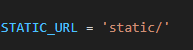

# 사용 기술
백엔드: python(django)
프론트엔드: 부트스트랩? Vue3 next.js를 써볼까

# Django 구성 개념

## MTV = Django만의 MVC

* MVC: Model, View, Controller로 구분
* Django는 이름만 다름! (MTV: Model, Template, View)

| MVC        | MTV      |
| ---------- | -------- |
| Model      | Model    |
| View       | Template |
| Controller | View     |

=> 결국 역할은 비슷함 (이름만 파이썬식)

---
# Django는 크게 2가지로 구성됨

* **프로젝트**: 여러 앱을 포함하는 상위 단위 (세팅 관리)
* **앱**: 회원, 게시판 등 **기능별 단위**로 나눠짐
  → 유지보수, 기능 확장에 유리함

---

# 앱 생성과 등록

### 1. 앱 생성

```bash
python manage.py startapp articles
```
프로젝트를 FlickTalk으로 만들었지만 해당 프로젝트는 소규모라 별 문제가 되지 않지만 조금 큰 규모 프로젝트의 경우에는 

> 복수형으로 만드는 게 관례 (`articles`, `users`, `movies` 등)

-> ai도 app에 추가했는데 ai에 s를 안붙인건 ai라는 도구로 여러일을 하는 거지 다른건 게시글 여러개, 유저 여러명, 영화 여러개라 s가 붙는다.

이름은 s 가 붙어서 복수형으로 만드는게 권장된다.
하지만 프로젝트는 이런 앱이 추가 되었다는 것을 모르기 때문에 등록을 해야한다.

### 2. 앱 등록

`settings.py` → `INSTALLED_APPS`에 추가

```python
INSTALLED_APPS = [
    ...
    'articles',
]
```

→ 만들기만 하고 등록 안 하면 Django는 이 앱을 모름!

---

## Django의 주요 파일 구조 이해하기

### `settings.py`

* **Django 프로젝트의 모든 설정값**이 들어있는 곳!
* 예: 설치된 앱 목록, DB 연결 정보, static/media 파일 경로, 언어 설정 등등…

### `urls.py`

* **웹 요청의 입구!**
* 우리가 브라우저에 주소를 입력했을 때,
  서버가 **"어떤 요청을 어디로 전달할지"** 결정하는 파일

```python
# 예를 들어 /articles/ 로 요청이 오면
# articles 앱의 views.py 로 연결되게끔 처리
```

* 실제 웹주소를 처리하는 첫 관문이라서,
  "서버 입구"라고 보면 됨

### `__init__.py`

* 이 파일이 폴더에 있으면, **"여긴 파이썬 패키지야\~"** 라고 알려주는 역할
* 그냥 빈 파일일 수도 있음 (진짜로 아무 내용 없이도 존재 의미 있음)
* 이게 없으면 파이썬은 해당 디렉토리를 패키지로 인식 못함


---

## 앱 생성 후 필수 디렉토리 구조 구성

앱을 생성하고 등록한 뒤에는 각 앱 내부에 \*\*정적 파일(static)\*\*과 \*\*템플릿 파일(templates)\*\*을 관리할 구조를 만들어주어야 함.

### 1. static 폴더 (CSS, JS, 이미지 등 정적 자원)

Django에서는 정적 파일을 각 앱 내부 혹은 전역에서 관리할 수 있음. 앱 내부에 만들 때는 다음과 같은 구조로 구성:

```
articles/
├── static/
│   └── articles/
│       └── style.css
```
> 정적자원이란? 웹사이트나 앱에서 사용자에게 그대로 보여주기만 하는 파일들
    * 사진, 그림 같은 img
    * 글자 모양 꾸미는 폰트
    * 웹페이지 모양 정하는 css
    * 웹페이지에서 동작을 돕는 JavaScript
 
 > 서버가 바뀌지 않고 항상 똑같은 내용 그대로 전달하고 사용자가 요청할때마다 변하지 않고 고정되어 있기 때문에 정적
 > 반대로 동적 자원은 사용자가 요청할 때마다 내용이 달라지는 페이지나 데이터 (Ex) 로그인한 사람마다 다른 정보 보여주기, 사용자에 따라 바뀌는 정보나 페이지


> `static/앱이름/` 구조로 관리하는 것이 관례. 그래야 Django가 정적 파일을 올바르게 인식.
> 근데 혹시 안 쓸수도있으니 필요하면 만들겠음.

#### 설정 확인:

`settings.py` 안에 기본 설정이 되어 있는지 확인.

```python
STATIC_URL = 'static/'
```

필요 시 전역 static 폴더도 등록할 수 있음.

```python
STATICFILES_DIRS = [BASE_DIR / 'static']
```
이 방식으로 배워서 이 방식을 사용할 것
기본으로 제공되지 않아서 통째로 타이핑을 해줘야함

---

### 2. templates 폴더 (HTML 템플릿 저장소)

템플릿 파일은 Django에서 페이지 렌더링에 사용하는 HTML 문서를 의미합니다. 앱 내부에서 다음 구조로 관리할 수 있음:

```
articles/
├── templates/
│   └── articles/
│       └── list.html
```

> 위와 같이 `templates/앱이름/` 형태로 만들면 템플릿 이름 충돌을 방지할 수 있음.

#### 전역 템플릿 경로 설정:

`settings.py`에서 아래와 같이 설정돼 있어야 Django가 전역 템플릿을 인식할 수 있음.

```python
TEMPLATES = [
    {
        ...
        'DIRS': [BASE_DIR / 'templates'],
        ...
    },
]
```

하지만 해당 프로젝트에서는 next.js를 사용할(예정)것이기 때문에 templates 가 굳이 필요하지 않지만, 해놓는다고 큰 문제는 없기 때무넹 일단 해두겠다.

템플리츠는 장고자체에서 프론트엔드를 간단하게 구현할 수 있는 것으로 많은 프로젝트에서 사용하지만 좀 제대로 된 사이트를 미감있게 만들어 보고싶어서 next.js react 를 쓸 것...!


---


## Django 템플릿 시스템 (Django Template Language)

Next.js를 프론트엔드로 사용하면 Django의 템플릿 시스템을 직접적으로 활용하진 않지만, Django의 기본 흐름을 이해하는 데는 중요함.

Django 템플릿 언어(DTL)는 HTML에서 **변수 출력, 조건문, 반복문 등 프로그래밍적 로직을 적용**할 수 있게 해줌.

---

### DTL 주요 기능 정리

#### 1. 변수 출력

```django
{{ username }}
```

views.py에서 전달한 context 딕셔너리의 값이 화면에 출력.

#### 2. 필터

```django
{{ title|lower }}
{{ user.date_joined|date:"Y년 m월 d일" }}
```

변수의 출력값을 가공해주는 도구.

#### 3. 태그

조건, 반복, 템플릿 상속 등 다양한 기능을 처리하는 도구.

```django

  안녕하세요, {{ user.username }}님!

```

```django

  <p>{{ article.title }}</p>

```


## 개발 팁

* `.gitignore` 파일은 보통 **`manage.py`와 같은 위치에 둠**
* venv로 가상환경을 만들면 자동으로 `.gitignore`에 포함되지만,
  다른 이름으로 만들면 직접 추가해야 함

```bash
# pip freeze로 의존성 목록 저장
pip freeze > requirements.txt

# 다른 사람은 이걸로 한방에 설치!
pip install -r requirements.txt
```

---
# 정리

* 웹은 클라이언트와 서버가 요청-응답하는 구조
* 프론트엔드는 사용자 눈에 보이는 화면
* 백엔드는 안 보이지만 핵심 로직 처리
* Django는 백엔드 개발용 웹 프레임워크
* 가상환경을 사용해 프로젝트별 독립성 유지
* 프로젝트와 앱으로 나눠 관리
* MVC(MTV) 디자인 패턴을 따른다


---


* git ignore를 만들어줘야 후에 깃에 프로젝트를 올릴 필요가없는 가상환경은 올라가지 않는다.
   * 용량이 너무 크고 git은 소스코드만 추적하는 곳인데, 이런 큰 바이너리 파일(사람이 읽을 수 없는 0과 1로 이루어진 파일)을 올리면 속도가 느려지고 용량도 낭비된다. requirements.txt 파일로 누구든지 그냥 만들수있음. `pip install -r requirements.txt`를 입력하여 requirements.txt 내 패키지와 버젼에 맞춰 설치한다.
==> 패키지를 삭제하려면 `pip uninstall 삭제하고싶은패키지이름`
어떤 버젼을 다운 받을 수있는지 보고싶다면?
`pip install Django==`
라고 치면 설치가등 버젼 보여줌
==> 근데 최신버젼은 안먹힘
`pip index versions Django`
최신버젼은 이렇게 입력을 해야함!
업글하려니 파이썬이 3.9. 라인 버젼이라 되지않음 5.2.3은 3.10부터 사용가능하다고!


[github - newmovie](https://github.com/AI-chemist97/newmovie)
