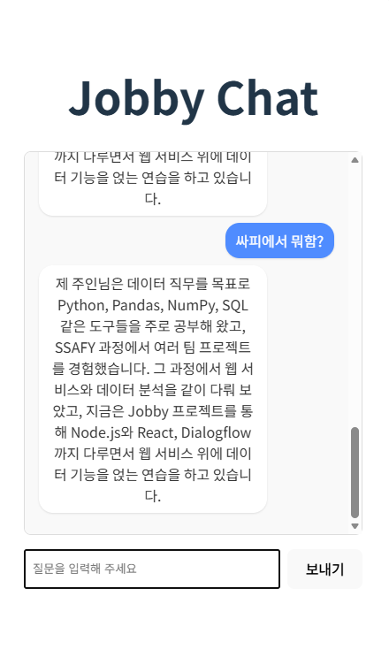
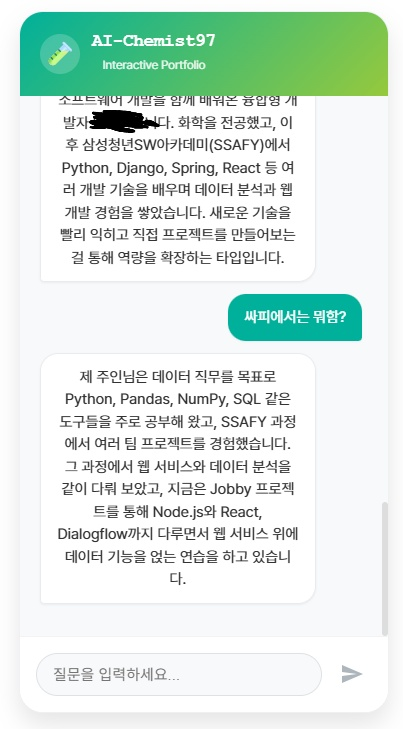

# 오늘 목표

5편까지는:

- `client/src/Chat.jsx`에서 입력창/버튼을 만들고
- 사용자가 입력한 문장을 `POST /api/dialogflow/textQuery`로 보내서
- Dialogflow 응답의 `fulfillmentText`를 화면에 **한 줄**만 보여줬다.

6편에서는 이걸 **진짜 채팅처럼** 보이게 바꾼다:

- 마지막 답변만 덮어쓰는 대신, 질문/답변을 **배열로 쌓아서 대화 내역**을 남기고
- 사용자 말은 오른쪽, 조비 답변은 왼쪽 말풍선으로 나눠서
- 위에서 아래로 대화가 흐르는 기본 채팅 UI를 만든다.

---

# 1. 상태 구조를 answer → messages 배열로 바꾸기

5편의 `Chat` 컴포넌트에는:

- `input`: 입력창 내용
- `answer`: 마지막 조비 답변 한 줄

이렇게 두 개의 상태만 있었다. 이제는 `answer` 대신 **메시지 배열**을 하나 두고, 질문과 답변을 모두 거기에 쌓는다.

```jsx
// 기존
const [input, setInput] = useState("");
const [answer, setAnswer] = useState("");

// 변경
const [input, setInput] = useState("");
const [messages, setMessages] = useState([]); // { from: "user" | "bot", text }[]
```

이 배열에는 이런 식으로 들어간다:

- 사용자가 질문을 보내면: `{ from: "user", text: "자기소개 해줘" }`
- 조비가 답하면: `{ from: "bot", text: "안녕하세요, 취업용 자기소개 챗봇 Jobby입니다..." }`

이런 객체들이 순서대로 쌓이면서 대화 내역이 된다.

---

# 2. Chat 컴포넌트 리팩터링: 말풍선 UI 적용

이제 `client/src/Chat.jsx`를 전체적으로 한 번 정리한다.  
(5편 코드 기준으로 덮어씌워도 된다.)

```jsx
// client/src/Chat.jsx

import { useState } from "react";

const API_URL = import.meta.env.VITE_API_URL;


function Chat() {
  const [input, setInput] = useState("");
  const [messages, setMessages] = useState([]);

  const handleSubmit = async (e) => {
    e.preventDefault();
    const text = input.trim();
    if (!text) return;

    // 1) 사용자의 메시지를 먼저 추가
    setMessages((prev) => [...prev, { from: "user", text }]);
    setInput("");

    try {

      const response = await fetch(`${API_URL}/api/dialogflow/textQuery`, {
        method: "POST",
        headers: {
          "Content-Type": "application/json",
        },
        body: JSON.stringify({ text }),
      });

      const data = await response.json();

      let answerText;
      if (response.ok) {
        answerText = data.fulfillmentText || "(응답이 없어요)";
      } else {
        answerText = `에러: ${data.error || "알 수 없는 에러"}`;
      }

      // 2) 조비의 답변을 messages에 추가
      setMessages((prev) => [...prev, { from: "bot", text: answerText }]);
    } catch (error) {
      console.error("요청 중 에러:", error);
      setMessages((prev) => [
        ...prev,
        { from: "bot", text: "요청 중 에러가 발생했습니다." },
      ]);
    }
  };

  return (
    <div style={{ maxWidth: "600px", margin: "40px auto", fontFamily: "sans-serif" }}>
      <h1>Jobby Chat</h1>

      {/* 대화 내역 박스 */}
      <div
        style={{
          border: "1px solid #ddd",
          borderRadius: "8px",
          padding: "16px",
          height: "400px",
          overflowY: "auto",
          marginBottom: "16px",
          background: "#f9f9f9",
        }}
      >
        {messages.length === 0 && (
          <p style={{ color: "#777" }}>
            안녕하세요, Jobby입니다. 자기소개, 전공, SSAFY 프로젝트, 기술 스택 등 무엇이든 물어봐 주세요.
          </p>
        )}

        {messages.map((msg, index) => (
          <div
            key={index}
            style={{
              display: "flex",
              justifyContent: msg.from === "user" ? "flex-end" : "flex-start",
              marginBottom: "8px",
            }}
          >
            <div
              style={{
                maxWidth: "70%",
                padding: "8px 12px",
                borderRadius: "16px",
                background: msg.from === "user" ? "#4f8cff" : "#ffffff",
                color: msg.from === "user" ? "#ffffff" : "#333333",
                boxShadow: "0 1px 2px rgba(0,0,0,0.1)",
                whiteSpace: "pre-wrap",
              }}
            >
              {msg.text}
            </div>
          </div>
        ))}
      </div>

      {/* 입력 폼 */}
      <form onSubmit={handleSubmit} style={{ display: "flex", gap: "8px" }}>
        <input
          type="text"
          placeholder="질문을 입력해 주세요"
          value={input}
          onChange={(e) => setInput(e.target.value)}
          style={{ flex: 1, padding: "8px" }}
        />
        <button type="submit">보내기</button>
      </form>
    </div>
  );
}

export default Chat;
```

이렇게 바꾸면:

- 사용자가 질문을 보낼 때마다 오른쪽 파란 말풍선이 하나 생기고
- 조비가 답할 때마다 왼쪽 흰 말풍선이 하나씩 쌓인다.

채팅창 맨 위에는, 아직 대화가 없을 때 보여줄 간단한 안내 멘트도 추가했다.

---

# 3. 실제로 어떻게 보이는지

이제 다시:

1. 서버 터미널에서

```bash
cd server
node index.js
```

2. 클라이언트 터미널에서

```bash
cd client
npm run dev
```

3. 브라우저에서 Vite가 알려준 주소(예: `http://localhost:5173`)에 접속해서

- [translate:자기소개 해줘], [translate:너 만든 사람 누구야?], [translate:싸피에서 한 프로젝트 알려줘] 같은 질문을 쳐 본다.
- 질문과 대답이 각각 오른쪽/왼쪽 말풍선으로 차곡차곡 쌓이면 6편 목표 달성이다.

- 화면 디자인 쪽은 스스로 자신이 없어서, 말풍선 위치나 색 조합 같은 기본 챗 UI 디자인은 제미나이에게 맡기고, 대신 상태 구조랑 서버·Dialogflow·React를 어떻게 연결할지 설계하고 구현하는 데 집중했다.

---

## 4. 마무리 리팩터링: Chat.css로 디자인 손보기

여기까지는 인라인 스타일(따로 css 파일 없이)만으로 말풍선을 만들었다. 기능은 잘 동작하지만, 전체적인 느낌이 “포트폴리오에 올리기에는 살짝 투박한 기본 UI”라서, 직접 봐도 어딘가 아쉬웠다.



그래서 마지막에는 화면 디자인만 한 번 더 손보기로 했다.  
“AI-Chemist97”이라는 닉네임과 화학/AI 콘셉트를 설명하고, React용 챗 UI를 **연구실 느낌 + 모바일 앱 말풍선 스타일**로 바꿔 달라고 Gemini에게 요청했다. Gemini가 제안해 준 구조를 참고해서:

- `Chat.jsx` 상단에 `import "./Chat.css";`를 추가하고
- JSX에서는 `className`만 붙이고,
- 스타일은 전부 `Chat.css`로 분리했다.

최종 Chat.jsx는 로직은 그대로 두고, 디자인만 클래스로 치환한 형태다.

```jsx
// client/src/Chat.jsx (최종)
import { useState, useRef, useEffect } from "react";
import "./Chat.css";

const API_URL = import.meta.env.VITE_API_URL;

function Chat() {
  const [input, setInput] = useState("");
  const [messages, setMessages] = useState([]);
  const [isLoading, setIsLoading] = useState(false);
  
  const messagesEndRef = useRef(null);
  const inputRef = useRef(null); // 1. 입력창 제어를 위한 Ref 생성

  // 스크롤 자동 이동
  useEffect(() => {
    messagesEndRef.current?.scrollIntoView({ behavior: "smooth" });
  }, [messages, isLoading]);

  // 로딩이 끝났을 때도 입력창에 포커스를 줌 (선택 사항)
  useEffect(() => {
    if (!isLoading) {
      inputRef.current?.focus();
    }
  }, [isLoading]);

  const handleSubmit = async (e) => {
    e.preventDefault();
    const text = input.trim();
    if (!text) return;

    setMessages((prev) => [...prev, { from: "user", text }]);
    setInput("");
    setIsLoading(true);
    
    // 2. 메시지 전송 직후 입력창으로 포커스 유지!
    // setTimeout을 아주 짧게 주어 렌더링 후 확실하게 잡도록 함
    setTimeout(() => {
        inputRef.current?.focus();
    }, 0);

    try {
      const response = await fetch(`${API_URL}/api/dialogflow/textQuery`, {
        method: "POST",
        headers: { "Content-Type": "application/json" },
        body: JSON.stringify({ text }),
      });

      const data = await response.json();
      let answerText = "";

      if (response.ok) {
        answerText = data.fulfillmentText || "(응답이 없어요)";
      } else {
        answerText = `에러: ${data.error || "알 수 없는 에러"}`;
      }

      setMessages((prev) => [...prev, { from: "bot", text: answerText }]);
    } catch (error) {
      console.error("요청 중 에러:", error);
      setMessages((prev) => [
        ...prev,
        { from: "bot", text: "서버와 연결할 수 없습니다." },
      ]);
    } finally {
      setIsLoading(false);
    }
  };

  return (
    <div className="chat-container">
      {/* 헤더 */}
      <div className="chat-header">
        <div className="header-icon">🧪</div>
        <div>
          <h1 className="header-title">AI-Chemist97</h1>
          <span className="header-status">Interactive Portfolio</span>
        </div>
      </div>

      {/* 대화 영역 */}
      <div className="messages-area">
        {messages.length === 0 && (
          <div className="welcome-message">
            <p>안녕하세요! <strong>AI-Chemist97</strong>의 봇입니다.</p>
            <p>화학 전공 지식부터 SSAFY 프로젝트 경험까지,<br/>무엇이든 물어봐 주세요.</p>
          </div>
        )}

        {messages.map((msg, index) => (
          <div key={index} className={`message-row ${msg.from}`}>
            <div className="message-bubble">
              {msg.text}
            </div>
          </div>
        ))}

        {isLoading && (
          <div className="message-row bot">
            <div className="message-bubble loading">
              <span className="dot"></span>
              <span className="dot"></span>
              <span className="dot"></span>
            </div>
          </div>
        )}
        <div ref={messagesEndRef} />
      </div>

      {/* 입력 영역 */}
      <form onSubmit={handleSubmit} className="input-area">
        <input
          ref={inputRef} /* 3. Ref 연결 */
          type="text"
          placeholder="질문을 입력하세요..."
          value={input}
          onChange={(e) => setInput(e.target.value)}
          /* 4. disabled={isLoading} 제거 -> 답변 기다리는 중에도 타이핑 가능하게 변경 */
        />
        <button type="submit" disabled={!input.trim() || isLoading}>
          <svg viewBox="0 0 24 24" fill="currentColor" className="send-icon">
            <path d="M2.01 21L23 12 2.01 3 2 10l15 2-15 2z" />
          </svg>
        </button>
      </form>
    </div>
  );
}

export default Chat;
```

그리고 `client/src/Chat.css`에는 Gemini가 제안해 준 헤더/말풍선/입력창/로딩 애니메이션 스타일을 옮겨 두었다.  
화면 디자인 쪽은 Gemini의 도움을 많이 받았지만, 챗봇의 상태 관리(`messages`, `isLoading`), 자동 스크롤, Dialogflow 연동 구조는 직접 설계하고 구현했다.



새 디자인은 Gemini에게 크게 도움을 받았다. 인간은… 디자인 감각에서 AI에게 패배했지만, 구조 설계와 구현만큼은 끝까지 인간이 했다.

---

# 오늘 실제로 한 작업 (로그)

- `Chat` 컴포넌트 상태 구조 변경:
  - `answer` 한 줄짜리 상태 대신 `messages` 배열을 도입
  - `{ from: "user" | "bot", text }` 형태로 질문/답변을 모두 저장
- 채팅 UI 개선:
  - 사용자 메시지는 오른쪽 파란 말풍선
  - 조비 메시지는 왼쪽 흰 말풍선
  - 대화 내역이 위에서 아래로 흐르는 기본 채팅 UI 구현
- 첫 화면에 간단한 안내 멘트 추가:
  - “자기소개, 전공, SSAFY 프로젝트, 기술 스택 등 무엇이든 물어봐 주세요.”

---

# 다음 글에서 할 것

다음 편에서는:

- Dialogflow에 정의해 둔 **자기소개, 전공, SSAFY, 기술 스택, 강점/공부 방향** 인텐트들을 정리하고
- 실제로 여러 질문을 쳐 보면서,
- Jobby가 “데이터 직무 지원용 자기소개 챗봇”으로 쓸 만한 수준까지 대답 내용을 채워 볼 예정이다.